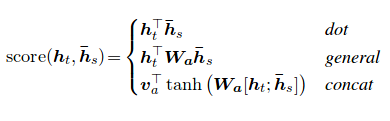

## Information

- **Title:** Neural Machine Translation by Jointly Learning to Align and Translate
- **Authors:** Dzmitry Bahdanau, Kyunghyun Cho, Yoshua Bengio
- **Link:** https://arxiv.org/abs/1409.0473
- **Venue:** ICLR 2015

## Summary

* (1) Introduction & Background
    * Bottleneck Problem
        * It is hard for encoder to compress all the necessary infomration into a fixed-length vector.   
* (2) Method
    * Neural Machine Translation with Attention
        * automatically (soft-) search for parts of a source sentence that are relevant to predict a target word
        * 
        * **context vector** (`c_t`): weighted sum over hidden & attention vector.
        * **attention vector** (`a_t`): softmax over the alignment score `e_ij`.
        * **alignment model** (`e_ij`): scores how much input's hidden vector at position `i` matches the output's hidden vector at position `j`.
    * Alignment Model
        * `e_ij` = `v^T tanh(W[h_i;h_j])`
        * single layer mlp where input is a concatenation of `h_i` and `h_j`.   
* (3) Results
    * Attention significantly improves NMT performance
        * Shorcut helps to deal with vanishing gradient problem.
    * Attention solves the bottleneck problem
    * Attention provides some interpretability   
* (4) Bahdanau attention vs Luong attention
    * 
    * Let's assume `h_t:[a,b]`, `h_s:[x,y]`, `W_a:[[1,2],[3,4]]`, `v_a:[1]`.
    * Bahdanau: additive attention (concat)
        * `s_a`: `tanh([1a + 2b + 3x +4y])`
        * score is computed with addtion over each feature.
        * `W_a` not only differentiate the importance of each feature, but also the importance of `h_t` and `h_s`. 
        * Though `v_a` can provide multiplicative attention, it is hard to interpret the meaning of score.
    * Luong: content-based attention (dot)
        * `s_a`: `[ax + by]`
        * score is computed by the similarity of two hidden vectors.
        * It is un-normalized version of Graves-attention: `cosine[h_t, h_s]`. 
        * It is a special form of a general attention where `W_a` is `I([[1,0],[0,1]])`
    * Luong: multiplicative attention (general)
        * `s_a`: `[1ax + 2ay + 3bx + 4by]`
        * score is computed with multiplication over each feature.
        * `W_a` is learning the importance over the combination of each features.
        * Restricting `W_ij=0`(`i`/=`j`), is equal to the content-based similarity, weighted by the importance of each feature.
            * e.g. `W_a:[[1,0],[0,2]]`, `s_a`:`[1ax + 2by]`.