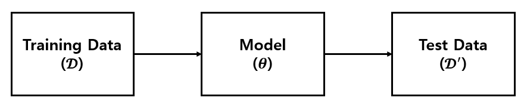
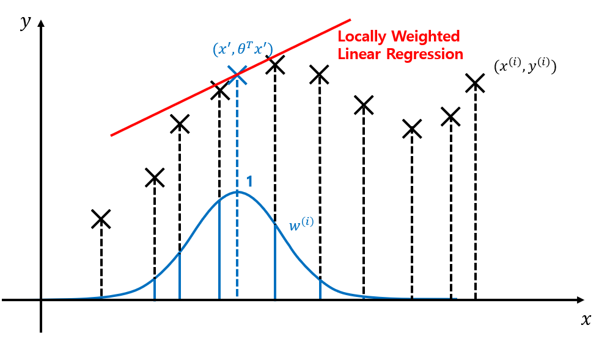
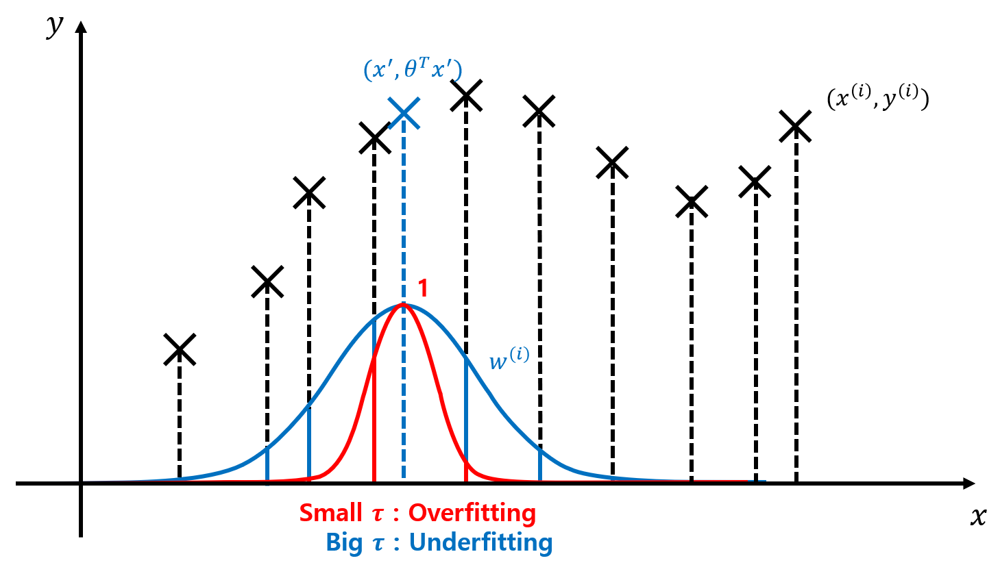
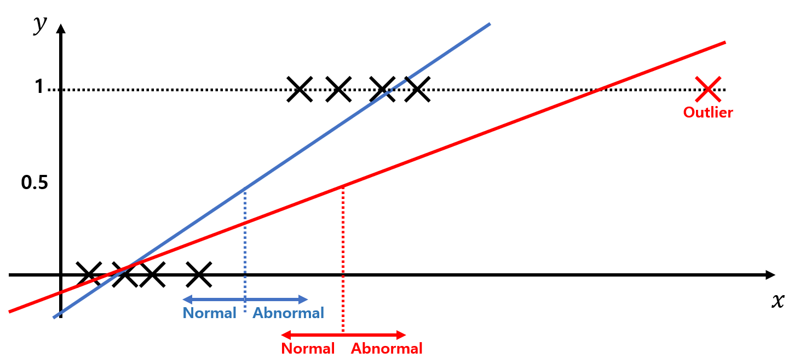
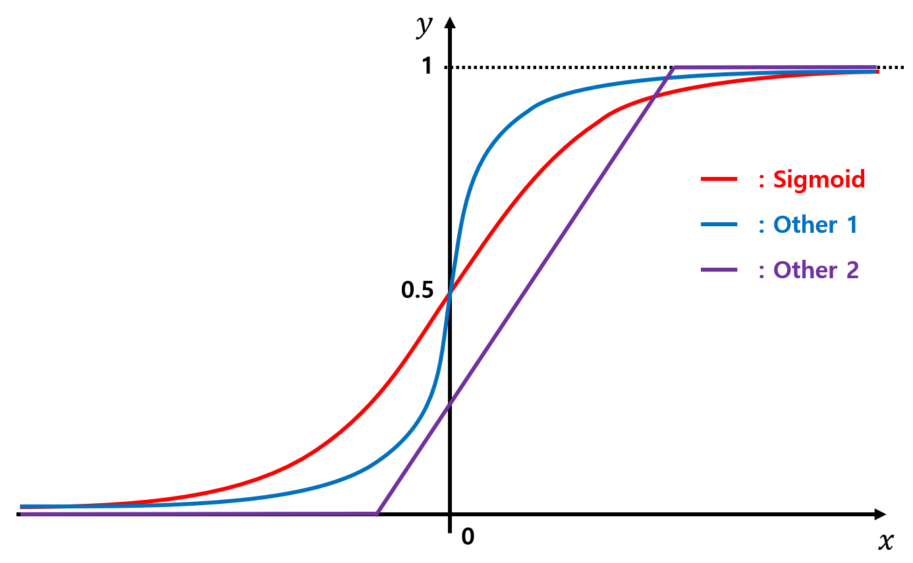
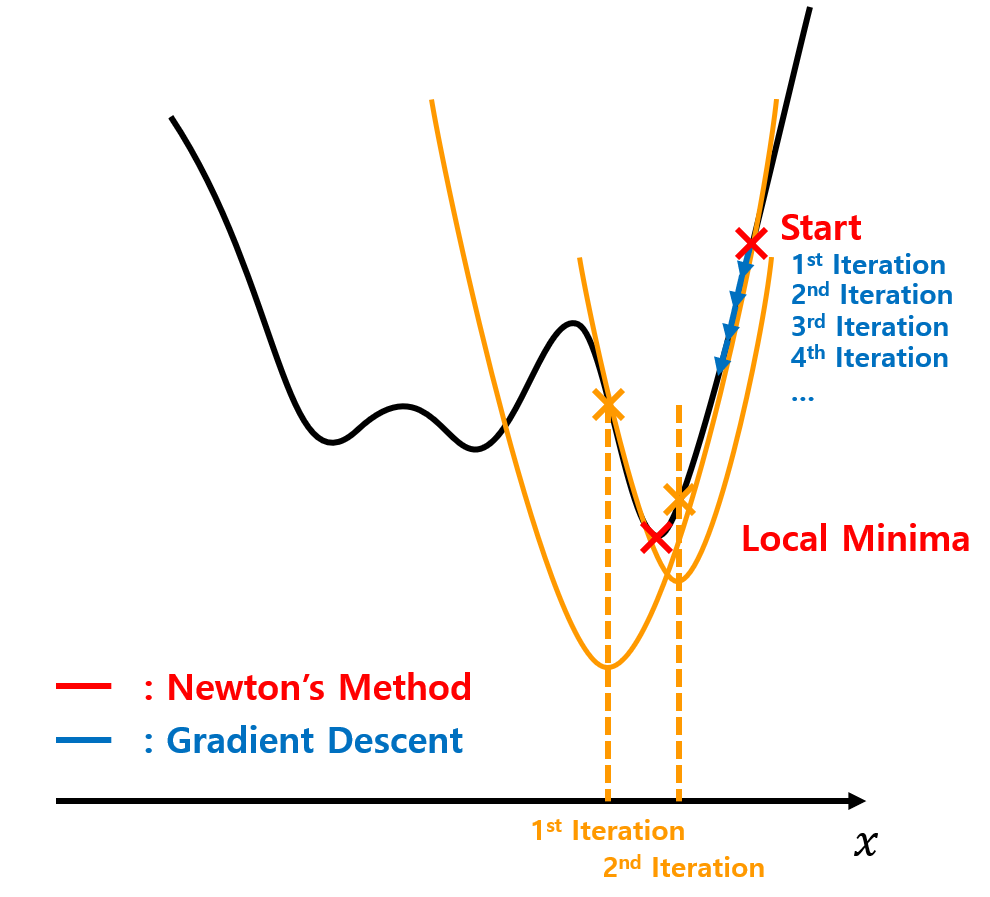

# DAVIAN Lab. Deep Learning Winter Study (2021)

- **Writer:** Minho Park

## Information

- **Title:** (cs229) Lecture 3 : Weighted Least Squares. Logistic regression. Newton's Method
- **Link:** http://cs229.stanford.edu/notes2020fall/notes2020fall/cs229-notes1.pdf
- **Keywords:** Parametric / Non-parametric Learning, Locally Weighted Regression, Probability Interpretation, Logistic Regression, Newton's Method

## Parametric / Non-parametric Learning Algorithm

### Definition (Andrew Ng)

- **Parametric Learning:** Fit fixed set of parameters ($\theta_i$) to data ($\mathcal{D}$).
- **Non-parametric Learning:** Amount of data/parameters you need to keep grows (linearly) with size of data. (It seems too biased to Locally Weighted Regression)
- **Non-parametric Learning:** Machine Learning algorithms other than Parametric Learning algorithms. (In our study!)

### Parametric / Non-parametric is the difference in perspective

- **Parametric Learning:** Suppose the model can fully describe $\mathcal{D}$ as $\theta$.
- **Non-parametric Learning:** No, it can't.

Therefore, in parametric aspect, we can erase $\mathcal{D}$ in our computer memory and make predictions just using $\theta$.  
However, Non-parametric Learning use $\theta, \mathcal{D}$ when inference $\mathcal{D}'$.

### Locally Weighted Regression

- **Motivation (Why?):** Underfitting / Overfitting problem. (e.g. Polynomial Regression)
- **Locally Weighted Linear Regression Algorithm:**

  1. Fit $\theta$ to minimize $\sum_i w^{(i)}(y^{(i)} - \theta^T x^{(i)})^2$. (Weighted Least Squares)
  2. Output $\theta^T x$.

  where $w^{(i)} = \exp \left( - {(x^{(i)} - x) \over 2\tau^2}\right)$.

- **Overfitting / Underfitting:**
  - If $\tau$ (which makes $w^{(i)} = e^{-1/2}$) is too small, model is likely to be overfitting.
  - Contrary, if $\tau$ is too big, model is likely to be underfitting.
  - $\tau \rightarrow \infty$ : Original Linear Regression

- **There is a lot of version of LWR**

## Probability Interpretation

**_Why Least Squares?_**

### Assumption

1. There is Error term which is Additive. $y^{(i)} = \theta^T x^{(i)} + \epsilon^{(i)}$.
2. $\epsilon^{(i)}$ are distributed i.i.d. (Independently and Identically Distributed)
3. $\epsilon^{(i)}$ are distributed according to a Gaussian distribution. $\epsilon^{(i)} \sim \mathcal{N}(0, \sigma^2)$.

I.e. the density of $\epsilon^{(i)}$ is given by,

$$
p(\epsilon^{(i)}) = {1 \over \sqrt{2\pi}\sigma} \exp\left( -{(\epsilon^{(i)})^2 \over 2\sigma^2} \right) \quad \text{(Assumption 3. Gaussian distribution)}
$$

This implies that,

$$
\begin{aligned}
  y^{(i)} | x^{(i)};\theta &\sim \mathcal{N}(\theta^T x^{(i)}, \sigma^2), & \text{(Assumption 1. Additive)} \\
  p(y^{(i)} | x^{(i)};\theta) &= {1 \over \sqrt{2\pi}\sigma} \exp\left( -{(y^{(i)}-\theta^Tx^{(i)})^2 \over 2\sigma^2} \right) \\
\end{aligned}
$$

It looks like an AWGN Channel.

### Frequentist Statistics / Bayesian Statistics

- **Frequentist Statistics $p(y^{(i)} | x^{(i)};\theta)$:** Probability of $y^{(i)}$ given $x^{(i)}$ and **parameterized as $\theta$**.  
  This notation implies parameters are **deterministic**. ($\theta$ is not a Random Variable.)
- **Bayesian Statistics $p(y^{(i)} | x^{(i)},\theta)$:** Probability of $y^{(i)}$ given $x^{(i)}$ **and $\theta$**.  
  This notation implies parameters are **stochastic**. ($\theta$ is a Random Variable.)

### Likelihood Function $L(\theta)$

- **Definition:** Distribution of $\vec{y}$ ($y^{(i)}$'s), given $X$ (Matrix of $x^{(i)}$'s) and $\theta$.  
  I.e. $L(\theta) = L(\theta;X,\vec{y}) = p(\vec{y}|X;\theta)$
- **Likelihood vs. Probability:**
  - **Likelihood of Parameters:** Function of $\theta$, parameterized as fixed $X, \vec{y}$.
  - **Probability of Data:** Probability(Function) of $\vec{y} | X$, parameterized as fixed $\theta$.

$$
\begin{aligned}
  L(\theta) &= \prod_{i=1}^m p(y^{(i)}|x^{(i)};\theta) & \text{(Assumption 2. i.i.d.)} \\
  &= \prod_{i=1}^m {1 \over \sqrt{2\pi}\sigma} \exp\left( -{(y^{(i)}-\theta^Tx^{(i)})^2 \over 2\sigma^2} \right) \\
\end{aligned}
$$

- **Maximum Likelihood:** Choose $\theta$ to maximize $L(\theta)$. (Make the data as high probability as possible.)
  - _MAP vs. MLE (Will be added)_
- **Log Likelihood:** The derivations will be a bit simpler.

$$
\begin{aligned}
  l(\theta) &= \log L(\theta) \\
  &= \sum_{i=1}^m \log\left({1 \over \sqrt{2\pi}\sigma} \exp\left( -{(y^{(i)}-\theta^Tx^{(i)})^2 \over 2\sigma^2} \right)\right) \\
  &= n\log{1 \over \sqrt{2\pi}\sigma} - {1 \over \sigma^2} \cdot {1 \over 2} \sum_{i=1}^m (y^{(i)}-\theta^Tx^{(i)})^2
\end{aligned}
$$

Hence, Maximize Log Likelihood is written as,

$$
\begin{aligned}
  \operatorname*{argmax}_\theta l(\theta) &= \operatorname*{argmin}_\theta {1 \over 2} \sum_{i=1}^m (y^{(i)}-\theta^Tx^{(i)})^2 \\
  &= \operatorname*{argmin}_\theta J(\theta) \quad \text{(Least-squares cost function)}
\end{aligned}
$$

## Logistic Regression

- **Motivation (Why?):** To design predictive model with categorical-value.
- **Classification Problem:** When applicate Linear Regression in binary classification, the model doesn't represent well.

### Sigmoid function (or Logistic function)

Simply, we want $h_\theta (x) = g(\theta^T x) \in [0, 1]$.  
There is a function, which range is $(0, 1)$.

$$
\sigma(z) = {1 \over 1 + e^{-z}}
$$

Its graph is shown below.

Then,

$$
h_\theta (x) = g(\theta^T x) = {1 \over {1 + e^{\theta^T x}}} \in (0, 1) \subset [0, 1]
$$

Which Was What We Want.

### Why not other functions?

There are lots of functions which $f : \mathbb{R} \to [0, 1]$.  
For example,

Other functions that smoothly increase from 0 to 1 can also be used, but for a couple of reasons (GLMs, generative learning algorithms), the choice of the logistic function is a fairly natural one.

### Fitting $\theta$

- **Assumption:**

  1. $y \in \{0, 1\}$
  2. Likelihood function.
     $$
     \begin{aligned}
      P(y=1|x;\theta) &= h_\theta (x) \\
      P(y=0|x;\theta) &= 1 - h_\theta (x)
     \end{aligned}
     $$

- **Maximum Likelihood Estimation.**

$$
\begin{aligned}
  p(y|x;\theta) &= (h_\theta(x))^y(1-h_\theta(x))^{1-y} \\ \\
  L(\theta) &= p(\vec{y}|X;\theta) \\
  &= \prod_{i=1}^m p(y^{(i)}|x^{(i)};\theta) \\
  &= \prod_{i=1}^m (h_\theta(x^{(i)}))^{y^{(i)}}(1-h_\theta(x^{(i)}))^{1-y^{(i)}} \\
  l(\theta) &= \log L(\theta) \\
  &= \sum_{i=1}^m y^{(i)} \log h_\theta(x^{(i)}) + (1 - y^{(i)}) \log (1 - h_\theta(x^{(i)}))
\end{aligned}
$$

- **Using Gradient Ascent Rule:** $\theta := \theta + \alpha \nabla_\theta l(\theta)$

  - Note that, we already know below equations.

    $$
    \begin{aligned}
      l^{(i)}(\theta) &:= y^{(i)} \log h_\theta(x^{(i)}) + (1 - y^{(i)}) \log (1 - h_\theta(x^{(i)})) \\
      h_\theta(x^{(i)}) &:= g(\theta^T x^{(i)}) = \sigma(\theta^T x^{(i)}) = 1/{(1+e^{-\theta^T x^{(i)}})}\\
      \sigma'(z) &= \sigma(z)(1-\sigma(z)) \\
    \end{aligned}
    $$

  - Then,

    $$
    \begin{aligned}
      {\partial \over \partial\theta_j} l^{(i)}(\theta) &= \left( {y^{(i)} \over h_\theta(x^{(i)})} - {(1-y^{(i)}) \over (1-h_\theta(x^{(i)}))} \right) {\partial \over \partial\theta_j} h_\theta(x^{(i)}) \\
      &= \left( {y^{(i)} \over \sigma(\theta^T x^{(i)})} - {(1-y^{(i)}) \over (1-\sigma(\theta^T x^{(i)}))} \right) {\partial \over \partial\theta_j} \sigma(\theta^T x^{(i)}) \\
      &= \left( {y^{(i)} \over \sigma(\theta^T x^{(i)})} - {(1-y^{(i)}) \over (1-\sigma(\theta^T x^{(i)}))} \right) \sigma(\theta^T x^{(i)}) (1 - \sigma(\theta^T x^{(i)})) {\partial (\theta^T x^{(i)}) \over \partial\theta_j} \\
      &= \left(y^{(i)}(1-\sigma(\theta^T x^{(i)})) - (1-y^{(i)})\sigma(\theta^T x^{(i)})\right)x^{(i)}_j \\
      &= (y^{(i)} - \sigma(\theta^T x^{(i)})) x^{(i)}_j \\
      &= (y^{(i)} - h_\theta(x^{(i)})) x^{(i)}_j \\
    \end{aligned}
    $$

  - Therefore, the result is similar to result of Linear Regression _(is this just luck?)_; but not the same algorithm, because $h_\theta(x^{(i)})$ is now defined as a non-linear function of $\theta^T x^{(i)}$.

    $$
    \begin{cases}
      \theta_j := \theta_j + \alpha (y^{(i)} - h_\theta(x^{(i)}))x^{(i)}_j & \text{Stochastic} \\
      \theta_j := \theta_j + \alpha \sum_{i=1}^m (y^{(i)} - h_\theta(x^{(i)}))x^{(i)}_j & \text{Batch} \\
    \end{cases}
    $$

## Newton's Method

- **What is this?:** Suppose we have some function $f : \mathbb{R} \to \mathbb{R}$ and find a value of $\theta$ so that $f(\theta) = 0$.
- **Algorithm:**
  $$
  \theta := \theta - {f(\theta) \over f'(\theta)}
  $$

### In our case,

We have to find $\theta$ which maximize $l(\theta)$.  
The maxima of $l$ correspond to points where $l'(\theta) = 0$.  
Let $f(\theta) = l'(\theta)$.

$$
\theta := \theta - {l'(\theta) \over l''(\theta)}
$$

This method means that approximate our function 2nd-order function, and find local minima/maxima of 2nd-order function. However, our function would not be 2nd-order in most cases. Therefore, we have to iterate this algorithm.

### Newton-Raphson Method

- **Hessian:** $(n + 1) \times (n + 1)$ matrix (include intercept term).
  $$
  H_{ij} = {{\partial^2 l(\theta)} \over {\partial\theta_i\partial\theta_j}}
  $$

$$
\theta := \theta - H^{-1} \nabla_\theta l(\theta)
$$

### Compare with Gradient Descent/Ascent

- **Graphically:**

- **Pros:** Newton's Method has less iteration
- **Cons:** Lots of computations when calculate $H^{-1}$, if $H$ is big.

### More information about Newton's method

1. [Newton-Raphson method (multivariate)](http://fourier.eng.hmc.edu/e176/lectures/NM/node21.html)
2. [Wikipedia: Newton's method in optimization](https://en.wikipedia.org/wiki/Newton%27s_method_in_optimization)
