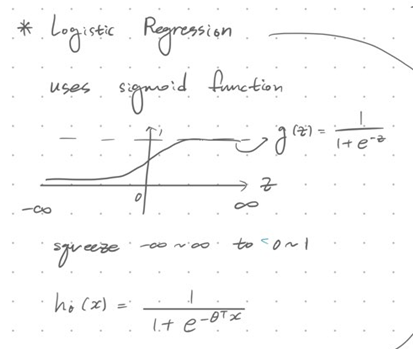
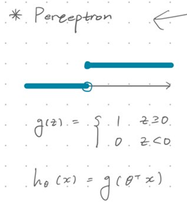
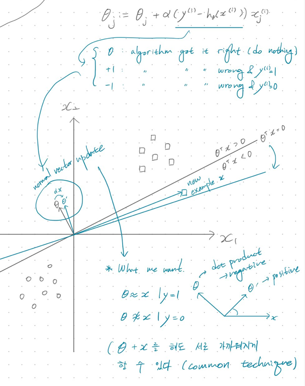
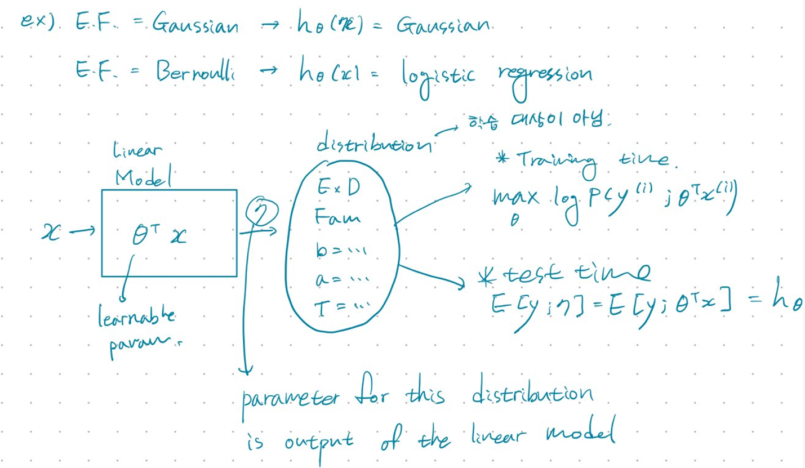
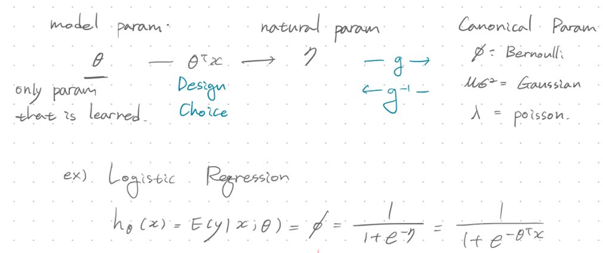

# DAVIAN Lab. Deep Learning Winter Study (2021)

- **Writer:** Min-Jung Kim

## Information

- **Title:** (cs229) Lecture 4 : Perceptron. Exponential Family. Generalized Linear Models.
- **Link:** http://cs229.stanford.edu/notes2020fall/notes2020fall/cs229-notes1.pdf   
http://cs229.stanford.edu/livenotes2020spring/cs229-livenotes-lecture4.pdf
- **Keywords:** Perceptron, Exponential Family, Generalized Linear Model, Softmax Regression (Multi-class classification)

## Perceptron
Perceptron is somewhat similar to sigmoid function but different.   
It is hard version of sigmoid function.   

- **Logistic Regression with Sigmoid function**   
</img>    
   
- **Perceptron**   
</img>    
   
- **Geometrical Interpretation of Perceptron theta update.**   
</img>    

> Perceptron is not something that's widely used in practice.   
> We study it mostly for historical reasons.   
> It is not used because it does not have a probabilistic interpretation of what 's happening.      
> Also it could never classify xor   

## Exponential Family
It is class of probability distributions, whos PDF can be written in the form   
   
-  => integrates to 1
      
> y : data (output)   
>  : natural parameter (parameter of distribution)   
> b(y) : base measure   
> T(y) : sufficient statistic. In this lecture, T(y) = y    
>  : log partition, normalizing constant

### Ex1 : Bernoulli Distribution
**Bernoulli Distribution**
   
 : probability of event   

**Matching with E.F.**   
   

### Ex2 : Gaussian Distribution (with fixed variance)
assume    
    
Gaussian Dist.   
 =>    
   
**Matching with E.F.**   
   
   
### Exponential Family Properties
a) MLE w.r.t.  --> concave
(Which means.. If we perform maximum likelihood on E.F, and when E.F. is parameterized in the natural parameters, then the optimization problem is concave.   
 Therefore, Negative Log Likelihood is convex)   
b)    
c)    
   
## GLM (Generalized Linear Model)   
We can build a lot of powerful models by choosing nappropriate E.F and plugging it onto a linear model.   

### Assumptions / Design Choices   
a)  ~ Exponential Family   
Depending on the problem that you have, you can choose any member of E.F as parameterized by    
b)    
c) Test Time Output =    
   
</img>    

### GLM Training   
No matter what kind of GLM you are doing, no matter which choice of distribution that you make,    
the learning update rule is the same.
   
**Learning Update Rule**   
   

### Terminology   
 = canonical response function   
 = canonical link function   
   
### 3 Parameterization   
</img>   
   
## Softmax Regression 
Yet another member of GLM family.
Usually, hypothesis equals probability or scalar, while softmax outputs prob. distribution.   

