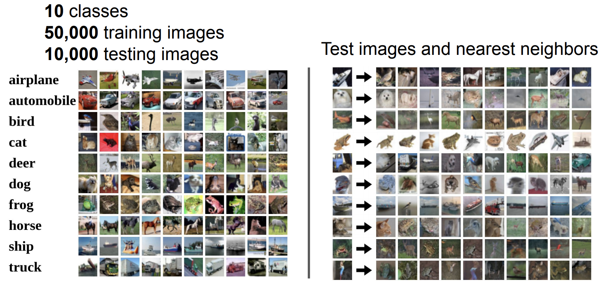
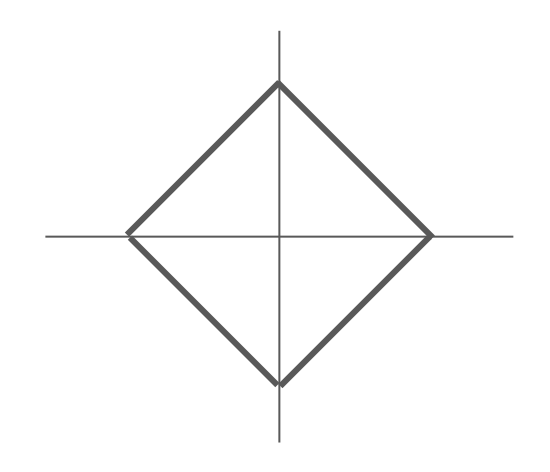
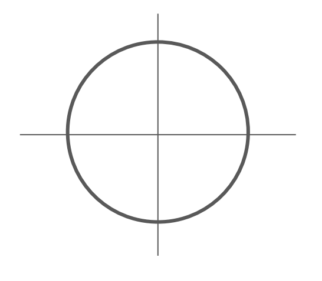
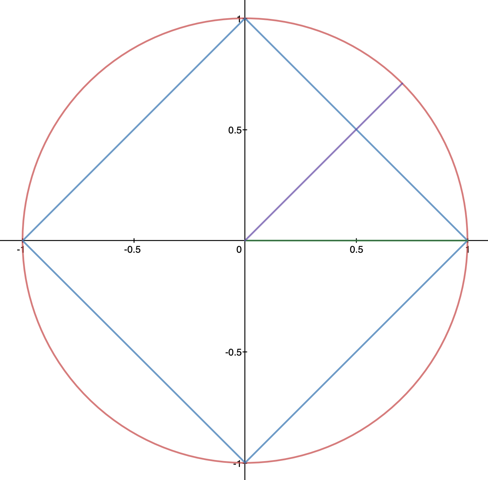
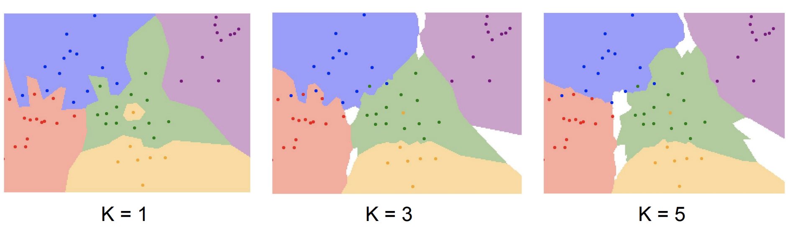
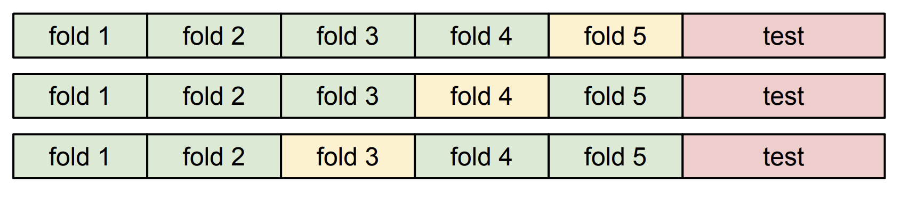
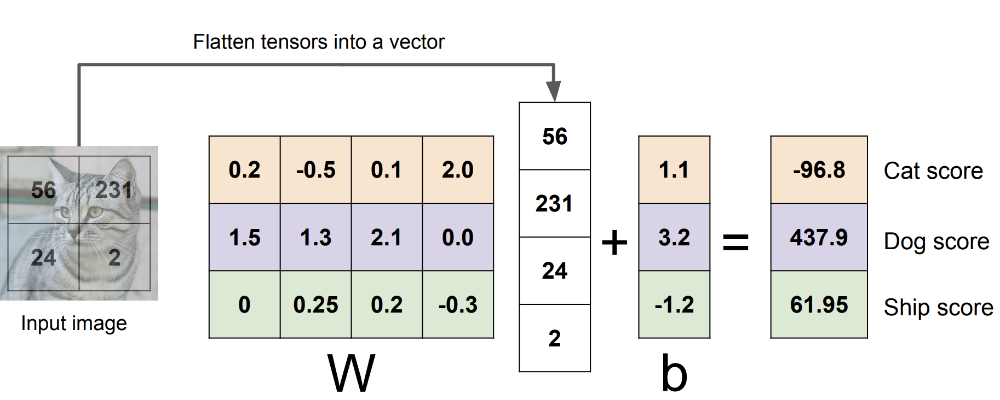
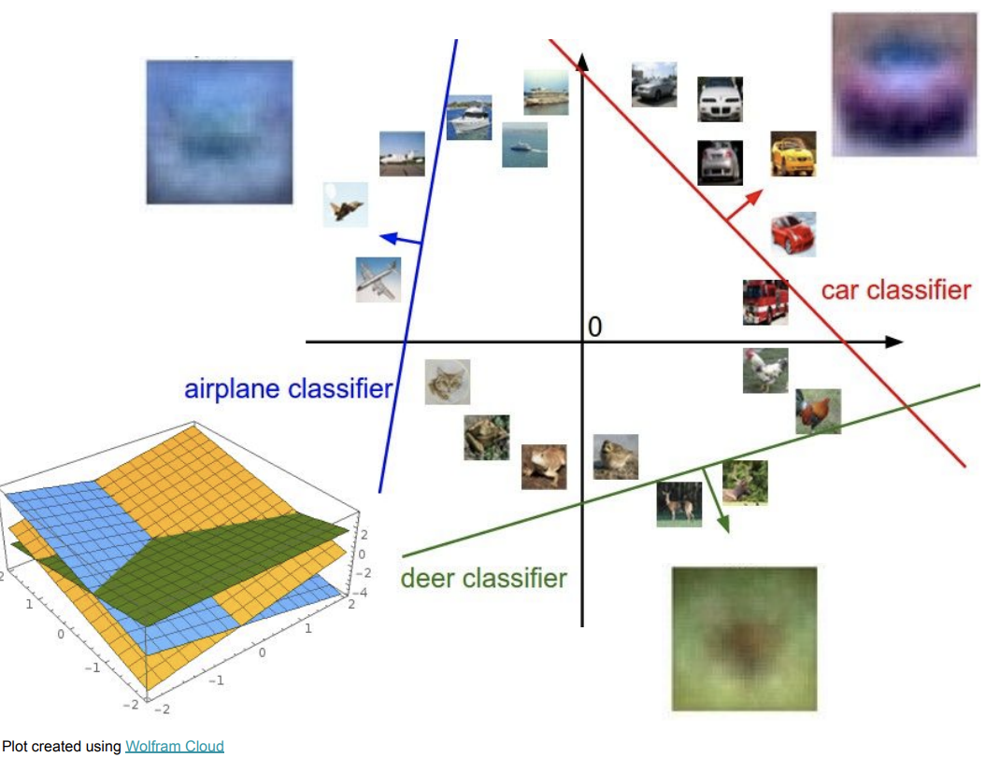

# DAVIAN Lab. Deep Learning Winter Study (2021)

- **Writer:** Yeojeong Park

## Information

- **Title:** (cs231n) Lecture 2 : Image Classification pipeline 
- **Link:** http://cs231n.stanford.edu/slides/2020/lecture_2.pdf
- **Keywords:**
-------------------------------------------------------

## Introduction of Image Classification

- **Image classification** is a core task in computer vision that classifies input image among given set of discrete labels.
- Challenges : Viewpioint variation, Background clutter, Illmination, Deformation, Occlusion, Intraclass variation, .....
- Many attempts have been made...

### Machine Learning : Data-Driven Approach

1. Collect a datasest of images and labels
2. Use Machine Learning to train a classifier
3. Evaluate the classifier on new images

## Nearest Neighbor : the simplest classifier
1. Memorize all data and labels
2. Predict the label of the most similar training image
  - For each test image, find **closest train image** and predict label of nearest image

### Distance Metric

#### L1 distance :  
 
$$
\begin{aligned}
 d(I_1, I_2) = \sum _p \vert I_1^p - I_2^p \vert
\end{aligned}
$$

#### L2 distance:
$$
\begin{aligned}
 d(I_1, I_2) = \sqrt{\sum _p ( I_1^p - I_2^p )^2 }
\end{aligned}
$$

- Difference : 
  - L1 depends on **choice of coordinates**
  - L1 is good when you know meaning of vector
  - L2 doesn't matter of coordinate frame
  - L2 is good for generic vector.
 

For example, consider the green line. Its $L_2$ distance is 1, same as $L_1$ distance.

If we rotate the coordinates to 45 degrees, its $L_2$ distance is still 1.

However, $L_1$ distance is $\sqrt{2}$ by its definition. As a result, $L_1$ distance can change by rotation.

### K-Nearest Neighbors
: take **Majority vote** from K closest points

- Limitation : Curse of dimensionality
   - K-NN is proper when data distribution is quite dense.
   - However, if dimension of data is increased we need more data to maintain the density

## Hyperparameter
= choices about the algorithm that we set rather than learn

### How to set hyperparameters
- Choose HP that work best on **(train) data**
  - only works well on training data when K=1 (if K>1, no works)
- Split data into **train and test**, choose HP that work best on **test data**
  - No guarantee that algorithm will perform well on unseen data
- Split data into **train, val and test**, choose HP on **val** and evaluate on test
  - Train algorithm with different HPs on training set 
  - Evaluate on validation set and pick HP of best performance
  - most common
- Cross-validation

## Cross validation

- Split data into **folds**, try each fold as validation and average the results
- Useful for small datasets, but not used too frequently in deep learning

### If K is very large, what happened?
(from [here](https://stats.stackexchange.com/questions/61783/bias-and-variance-in-leave-one-out-vs-k-fold-cross-validation/357749#357749))

- Leave-one-out cross validation(LOOCV) : Use only one data for validation(i.e. K = # of data)
- For predictions during cross validation, **LOOCV has low variance for it.**
  - since training sets between folds overlap substantially, and only one data shifted across folds.(**= Highly Correlated data**)
- For predictions after training on new datasets, **LOOCV has high variance for it.**
  - all folds in LOOCV are highly correlated -> each training set is almost same.
  - if there are some bad association between training and test set, model cannot identify the noise.
  - i.e. Model is **overfitted** to training dataset.
  - Variance increasing in predictions about test set or new training set.

-----------------------------
## Linear classifier

- **Weight W :** template for each specific class
- **Bias b :** data independence for some classes over another.(ex. if # cat >> # dog, then bias on cat is higher)
- **Dot product between W and input X :** similarity between template for the class and pixels of input img.
- **Score :** The larger scores, the larger probability of that input X being that class

