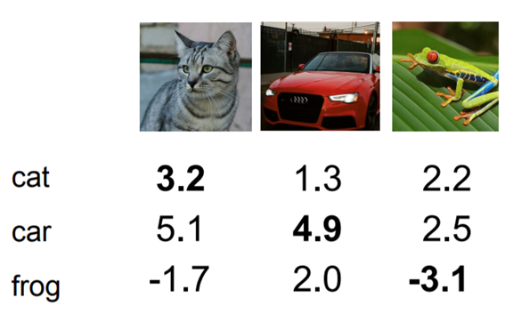
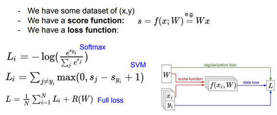
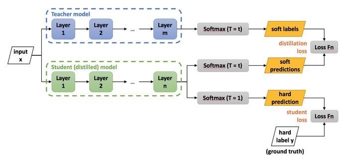

# DAVIAN DL winter study(2021)
* Writer: Jaeseong Lee
---
## Loss Function
- **Naive definition**: How bad our current model(classifier) is?
- **Example 1**: Multiclass SVM loss
  
  
    - setting: $x_i:= image$, $y_i:= label$, $s:=f(x_i, W)$
      - where, $s$ is a scores vector and $f(x,W) := Wx$.
    - $L_i=\sum_{j\neq y_i} max(0, s_j-s_{y_i}+1)$
      - where, $s_{y_i}:= true\ class\ score$, $s_i:=other\ class\ score$
    - Loss For cat class: $(5.1-3.2+1)+0=2.9$
    - Loss For car class: $0+0=0$
    - Loss For frog class: $(2.2+3.1+1)+(2.5+3.1+1)=12.9$  
   #
    - Entire loss: $L:={1 \over N}\sum_{i=1}^N L_i$ = $(2.9+0+12.9) \over 3$=$5.27$
- **Regularization**: Relax the model not to be **"overfitted"**
  - Description
    - $L(W) = {1 \over N}\sum_{i=1}^N L_i+\lambda R(W)$
      - $R\ is\ a\ regularization\ term.$
      - $\lambda\ is\ a\ regularization\ strength(hyper-parameter)$
  - Category
    - L2(Ridge): $\sum_{k}\sum_{l}W_{k,l}^2$ -> spread out the $W_i$s 
    - L1(Lasso): $\sum_{k}\sum_{l}|W_{k,l}|$ -> some $W_i$s goes to 0 ($\because$ substract specific constants)
  
- **Example 2**: Softmax Classifier
  - Same setting w/ above **Example 1**
  - $L_i=-logP(Y=y_i|X=x_i)=-log({e^{s_{y_i}} \over \sum_{j}e^{s_j}})$
  - Loss For cat class: $-log{24.5 \over (24.5+164.0+0.18)}=-log(0.13)=0.89$
- *Additional information: Ranking Loss & Margin-Loss in Recognition*
  - **Ranking loss**: MSE or CE loss predict label or value, but Ranking loss predict relative distances btween inputs
    - pairwise ranking loss
        
      - $x_a$=anchor sample, $x_n$=negative sample, $x_p$=positive sample
      - Objective: 
        - 1. learn distance $d$ between positive samples
        - 2. learn greater than $m$ distance between negative samples
      - $L(r_0,r_1,y)=y||r_0-r_1||+(1-y)max(0,\ m-||r_0-r_1||)$
        - when negative pair, $y=0$, positive pair, $y=1$
    - triplet ranking loss
        
      - Objective:
        - 1. $d(r_a,r_n)$ should larger than $m$
        - 2. $d(r_a,r_n)$ should larger than $d(r_a,r_p)$
      - $L(r_a,r_p,r_n)=max(0,\ m+d(r_a,r_p)-d(r_a,r_n))$
      - There are 3 cases:
        - 1. $d(r_a,r_n)>d(r_a,r_p)+m$: negative sample is already sufficient distant to anchor sample -> parameter are not updated
        - 2. $d(r_a,r_n)<d(r_a,r_p)$: negative sample is closer to the anchor than positive -> loss is positive
        - 3. $d(r_a,r_p)<d(r_a,r_n)<d(r_a,r_p)+m$: negative sample is more distant to the anchor than the positive, but not greater than margin -> loss is positive

- **Loss Function Summary**

    
    - **SVM** vs **Softmax**
      - SVM: When loss is 0, stop the algorithm 
        - e.g. Regard [1000,9,9,9] and [10,9,9,9] as same **(DON'T SEE ITS OWN CLASS!!)**
      - Softmax: They keep trying to increase the probability because **their own classes are still also considered!**
#
## Optimization
- **Naive definition**: Find the good parameters(W).

  - J is a Cost Function
  - Figure w/ single parameter
- **Method1**: Gradient Descent(GD)
  - $W_i:=W_i-\alpha\nabla_{W_i} L$ (updating)
    - where, $\alpha$ is learning rate
- **Method2**: Stochastic Gradient Descent(SGD)
  - Same as with GD
  - But, SGD don't use full data(approximate sum w/ minibatch)

- *Additional information: Knowledge distillation&self-distillation*
    - Knowledge distillation(NIPS 2014)
      - Definition: Transfer well-pre-trained Teacher network's knowledge to Student network(boosting small network's performance like big network)
   
   

   - Self-distillation(CVPR 2020)
     - Description: 
       - semi-supervised learning approach that works well even when labeled data is abundant.
       - Using equal-or-larger student module and noise added to the student during learning
         - 1.Train model A on labeled image and use it as a teacher network to generate pseudo-labels for unlabeled images
         - 2.Train a larger model B on labeled and pseudo labeled images
         - 3.Repeat above 2 processes by putting back the student

        

