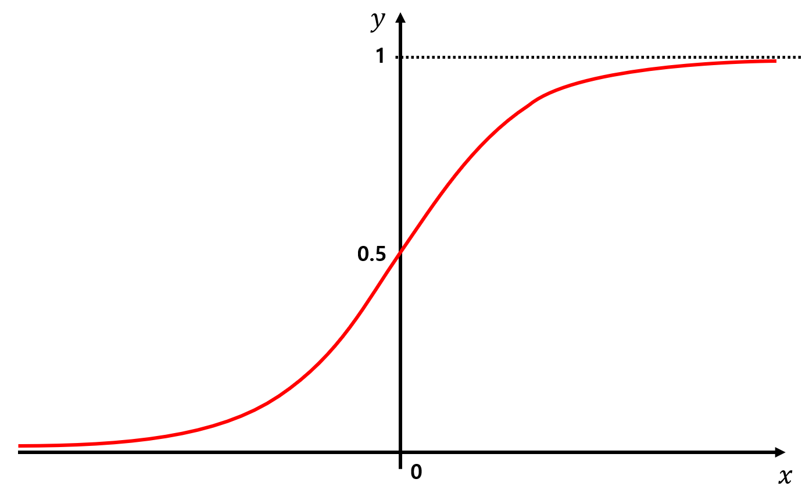
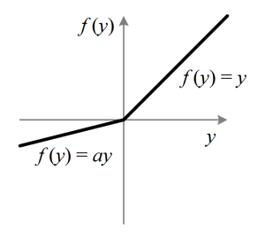

# DAVIAN Lab. Deep Learning Winter Study (2021)

- **Writer:** Yuri Kim

## Information

- **Title:** (cs231n) Lecture 7 : Training Neural Networks, part I
- **Link:** http://cs231n.stanford.edu/slides/2020/lecture_7.pdf
- **Keywords:** Activation functions, Data processing, Batch Normalization

## Details of training Neural Networks
- How do we set up our neural networks at the beginning?
- Which activation functions should we choose?
- How to preprocess the data
- Weight initialization, regularization and gradient checking
- Training dynamics (which include spcecific parameter update rules & hyperparemter optimization)
- Evaluation & model ensembles

## Activation Functions : 7 types

### 1. Sigmoid



- The **sigmoid** function takes each element and squashes it into the range of [0,1]</br>
    Thus, if you get very high values as input, the output would be very near to 1. On the other hand for negative values, it will be near zero
- Saturation at 'firing rates' of a neuron

#### Problem
1. Saturated neurons can *kill off* the gradients : In the regions where the function is flat, the gradient will be 0. Hence when we multiply it with the upstream gradient, it will become very small and "kill" the gradient flow
2. Sigmoid outputs are not zero-centered : If the inputs are all positive, the gradients on the weights will all be in the *same direction* which gives very inefficient gradient updates

**Example)** When w(weights) is 2-dimensional, only two gradient update directions will be possible which will result in a **zig zag path** which is less efficient than if the optimal direction was directly followed

3. Calculating the exponential part of the sigmoid function is expensive

### 2. Tanh

- Tanh squashes each element into a range of [-1,1] : **zero-centered**

#### Problem
- However it still kills the gradient flow when saturated(flat)
&#8594; a bit better than sigmoid

### 3. ReLU
f(x)=max(0,x)</br>

- It doesn't saturate in the positive region
- Computationally efficient
- Coverges about 6 times **faster** than sigmoid/tanh
- Biologically more plausible : closer approximation in neuroscience experiments

#### Problem
- Still not zero-centered
- The negative half is still saturated and kills the gradient
- **Dead ReLU** : will never activate and update
```
Reason 1. Bad initialization : weights can be off the data cloud and will never get input to activate
Reason 2. High learning rate : start off with a good ReLU but the updates are too huge and the weights jump around
→ ReLU units get knocked off the data manifold during training
```
> Initializing with slightly positive biases may increase the likelihood of it being active and more **firing** ReLUs

### 4. Leaky ReLU
f(x)=max(0.01x,x)</br>

- No saturation at the negative space(No gradient dying problem)
- Computationally efficient
- Converges much faster than sigmoid/tanh

### 5. PReLU
f(x)=max(ax,x)</br>

- Because the slope in the negative regime is trained as a parameter, it gives the model more *flexibility*

### 6. ELU
0&space;\\&space;&\alpha(exp(x)-1)&space;\text{&space;if&space;}&space;x\leq&space;0&space;\end{cases}" title="f(x)=\begin{cases} &x \text{ if } x>0 \\ &\alpha(exp(x)-1) \text{ if } x\leq 0 \end{cases}" />


- Closer to zero mean outputs
- Compared to leaky ReLU, it builds back to the negative saturation regime which adds more robustness to noise

### 7. Maxout Neuron


- Generalizes the ReLU and the Leaky ReLU
- Operating in a linear regime, it doesn’t saturate or die
</br> &#8594; However this **doubles** the number of parameters and neurons

&#8756; In conclusion, **use ReLU** with caution in adjusting learning rates. Also, try out other variants of it or tanh but don't use sigmoid.

## Data preprocessing
- Take the original data and **zero-mean** them and **normalize** it finally
- However when the inputs are all positive or biased, the gradients of the weights are all in the same direction and thus, we achieve *suboptimal optimization*(revisit the zigzag problem)

- In practice the zero-centering is done but not much of normalization since you have *relatively comparable scale* and distribution in pixels compared to more general machine learning problems that have very different scale
- Likely, PCA or whitening is not as common because it is more preferable to have the spatial structure over the original image
- For testing, we apply the **same empirical mean** that was used in training
---------------------------
### In practice for images
1. Subtract the mean image from each image which has the same size(ex. AlexNet)
2. Subtract per-channel mean: take the mean by channel(RGB) when it is similar across the whole image which is easier(ex. VGGNet)

## Weight Initialization
1. Small gaussian random numbers
    - When sd is 1e-2 : will be a problem as the network grows and becomes deeper
    </br> &#8594;As we multiply by w, the values quickly shrink and collapse and eventually **all activation** will become 0, thus no learning
    - When sd is 1 : weights are going to be very big which will have saturated regimes
    </br> &#8594;**Local gradients** will be 0, thus no learning
2. Xavier initialization
- The basic idea is that scale the weights by the number of the inputs so that the variance of the input should be the same as the variance of the output &#8594; **Unit Gaussian!**
- Problem : This does not hold for ReLU because half of them are zero and the variance will be too small
&#8594; Solution : Divide by an extra 2, adjusting for the fact that half the neurons get killed

## Batch normalization
**Force the activation to have unit gaussian activations** : normalize by the mean & std of each neuron
- Compute the empirical mean and var independently for each dimension and normalize by this
</br> &#8594; usually inserted **after** fc layers because in cnn when we multiply with W, it can result in bad scales and batch normalization can undo this effect

- For **convolution layers**, normalize jointly of both dimension *and* training examples so that nearby locations will be the same in line with the convolutional property &#8594; one mean and std per activation map
-----------------------------------------
### What if we want control over how much saturation to have?
We currently are basically constraining the regime into the tanh layer so that there is no saturation. But what if we may want saturation up to some extent?
- Additional parameters : &#947; and &#946;


> When our network learns the scaling factor(&#947;) to be the variance, and &#946; to be the mean, this allows to recover the identity function.</br>
> This will give us the flexibility of making our activation(tanh) less saturated and have good training

## Babysitting the learning process
- How do we monitor the training?
- How do we adjust hyperparameters to get good learning results?

1. Preprocess the data and choose & initialize the architecture
2. Forpass through the network and check if our **loss** is reasonable based on the activation function or number of labels
3. Run a **sanity check** on whether the loss goes up when we crank up the *regularization*
4. Start training with small data and see if we get good training loss whilst overfitting
5. Once we're done with sanity checks, start with small regularization and determine the learning rate
</br> &#8594; If the loss barely changes, it may be because the learning rate is too *small* and is not getting updated well
</br> &#8594; If the loss is NaN, the learning rate is too *big* so our cost has exploded

## Hyperparameter Optimization
To pick the best hyperparameters, try cross validation in the following steps : 
- Pick values that are pretty spread apart
- Run a few epochs and see which values are good or not
- After finding a general range, run CV for a **longer and finer** search
> Tip 1 : To detect NaNs beforehand, look at the costs every iteration and if you get a value much bigger than your original loss, break the loop and try some other value</br>
> Tip 2 : Try log instead of uniform values because they will be multiplied</br>
> Tip 3 : Make sure the best value is somewhere middle in the range instead of the edge to fully explore possible choices

## Random search vs grid search
Better to sample from **random values** than grids

- It is highly likely that the action space would be fully explored due to the **randomness**, which would take a long time for the grid search to reach and cover
- This works best under the assumption that *not all hyperparameters are equally important*
- Intuitively, random search would work best in **low-dimensional data** as the search time would be optimal with less numbers of iterations

## Hyperparameters to play with
- Loss curves that are flat at the beginning then starts to train generally means *bad initialization*
- Big gap between training and validation accuracy would indicate **overfitting**, thus you would need regularization
- When there's no gap between training & validation accuracy, try increasing the model capacity since you haven't overfit yet
- You don’t want your updates to be too large or too small compared to your value to have it dominate the values or have a very small effect
</br> &#8594; ratio should be around **0.0001**

#### Reference & Further readings
- http://sqlml.azurewebsites.net/2017/08/09/neural-network/
- https://medium.com/analytics-vidhya/activation-functions-why-tanh-outperforms-logistic-sigmoid-3f26469ac0d1
- https://nittaku.tistory.com/267
- https://analyticsindiamag.com/why-is-random-search-better-than-grid-search-for-machine-learning/
