# DAVIAN Lab. Deep Learning Winter Study (2021)

- **Writer:** Dongmin You

## Information

- **Title:** (cs229) Lecture 9 : CNN Architectures
- **Link:** http://cs231n.stanford.edu/slides/2017/cs231n_2017_lecture9.pdf
- **Keywords:** AlexNet, VGGNet, GoogLeNet, ResNet, Network in Network, Wide ResNet, ResNeXT, Stochastic Depth, DenseNet, FractalNet, SqueezeNet

## Case Study
 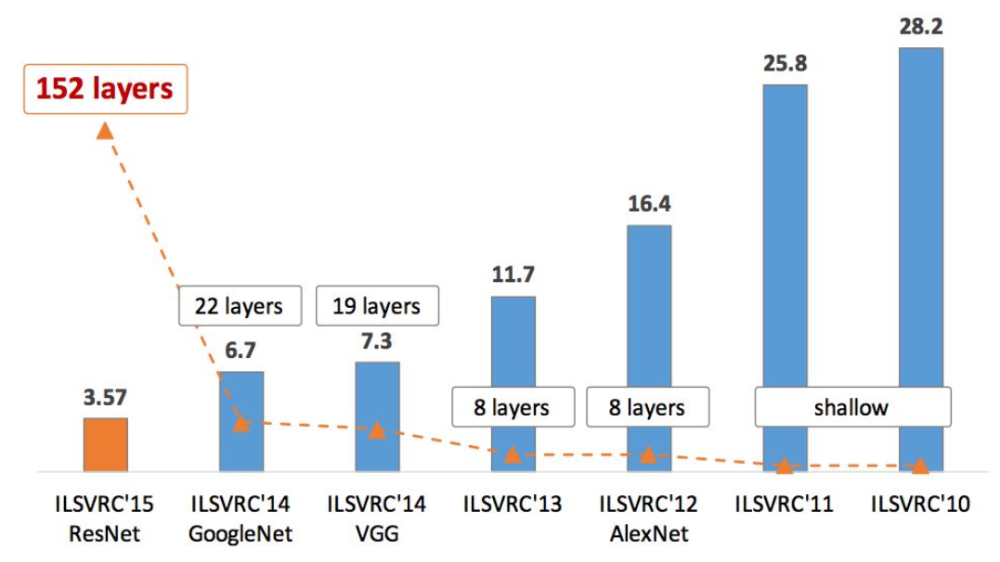
 
### 1. AlexNet (2012)
 - First large scale CNN able to do well ImageClassification model, 2 pararelled gpu computings
 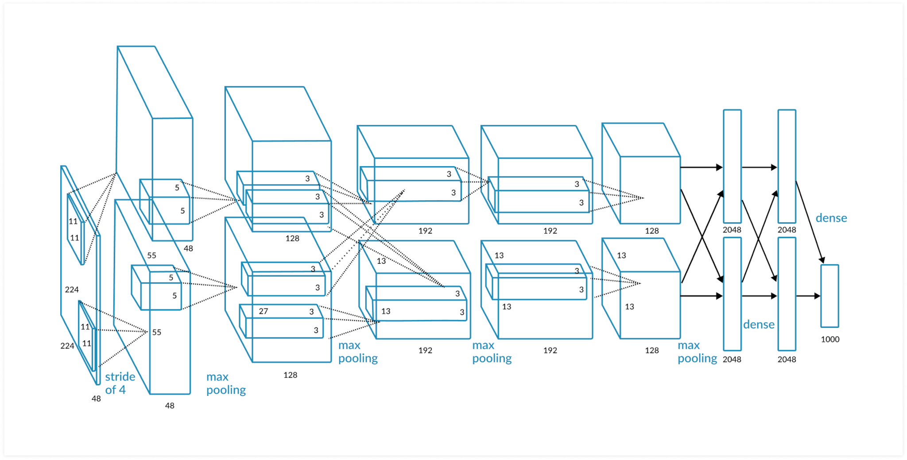
 
 *Details
 *First use of ReLU
 *Network spread across 2 GPUs, half the neurons one each GPU due to the lack of memory (communications across GPUs : conv3, FCs)
 
 - ZFNet(2013) : Improved hyperparameters
 
 
### 2. VGGNet (2014)
 - Small filters(3x3 conv), Deeper networks
 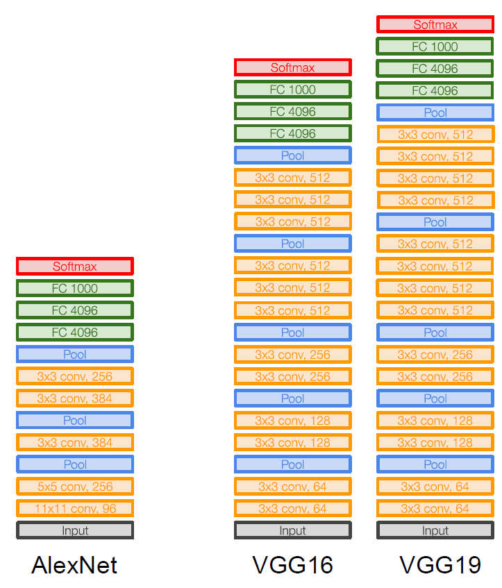
 - Why use small filters?
 -> Stack of three 3x3 conv(stride 1) layers has same "Effective receptive field" as one 7x7 conv layer with deeper, more linearities, small parameters : 27 vs 49
 - Problems : too many computes & parameters (heavy)

 *Details
 *FC7 features generalize well to other tasks
 
### 3. GoogLeNet (2014)
 - Computational efficiency, inception modules, Bottleneck layers, Auxiliary classification outputs
 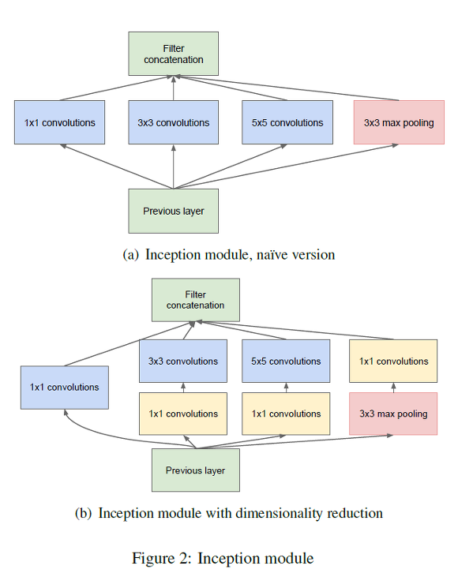
 - Apply parallel filter operations on the input from previous layer : 1x1, 3x3, 5x5, max pooling(add small translation invariance) -> concatenate
 - Problems of Naive Inception module : Conmutational became heavy after concatenate
 - Solution : Dimension reduction with adding 'bottleneck layers(1x1 conv)' to control depth
 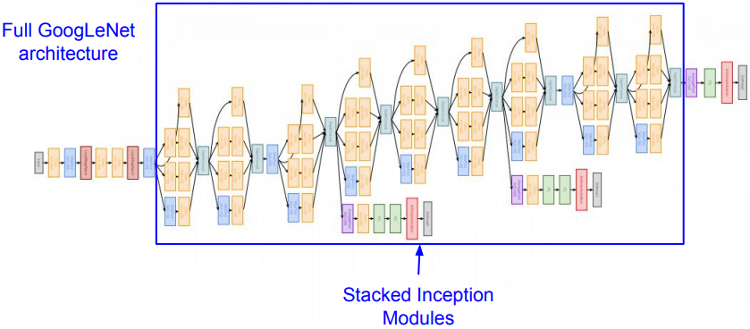
 
 *Details
 *Add Auxiliary classification outputs to inject additional gradient at lower layers to prevent gradient vanishing
 
### 4. ResNet (2015)
 - Revolutional deep 152 Layers, Residual Connections

 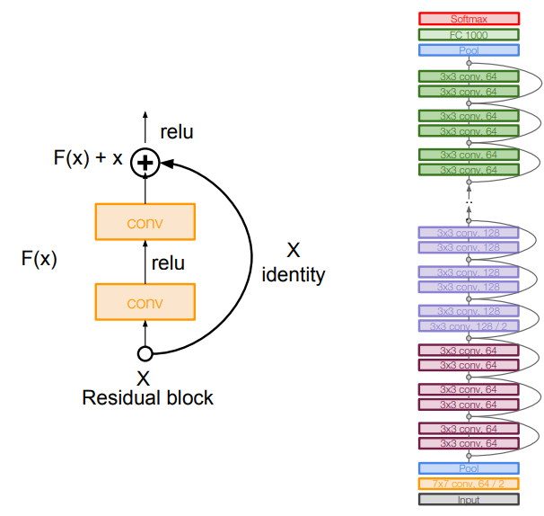
 - Previous Problem : Just stacking deeper layers on a "plain" convolutional neural network makes optimiazation problem
 - Solution : Using identity mapping

 *Details
 *Xavier/2 initialization

### Comparing complexity
 
  
## Other architectures to know

### 1. Network in Network (2014)
 - Precursor to GoogLeNet and ResNet "bottleneck" layers
 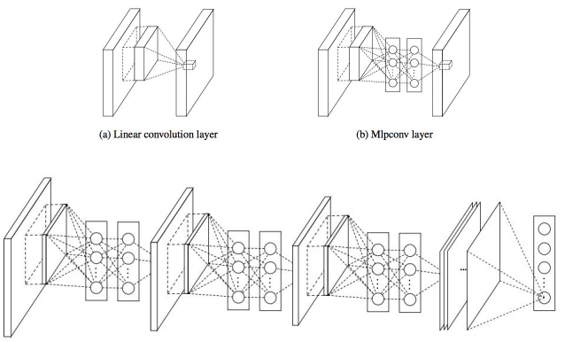
 
### 2. Wide ResNet (2016)
 - Use wider residual blocks, increase width instead of depth and made computionally efficient
 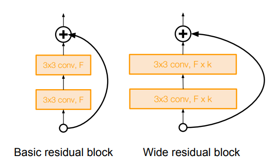
 
### 3. ResNeXt (2016)
 - ResNet ideas * Parallel pathways similar in spirit to inception module (Increasing width)
 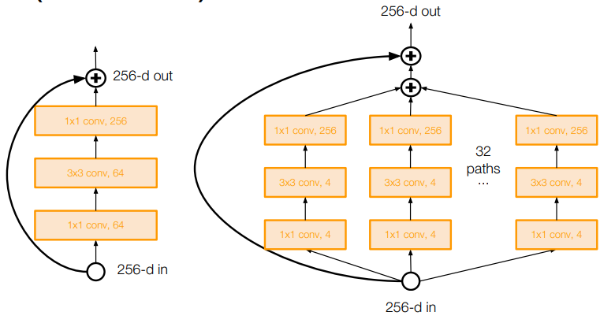
 
### 4. Stochastic Depth (2016)
 - Randomly drop a subset of layers during each training pass
 
 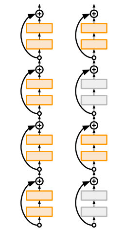
 
### 5. DenseNet (2017)
 - Each layer is connected to every other layer in  feedforward fashion
 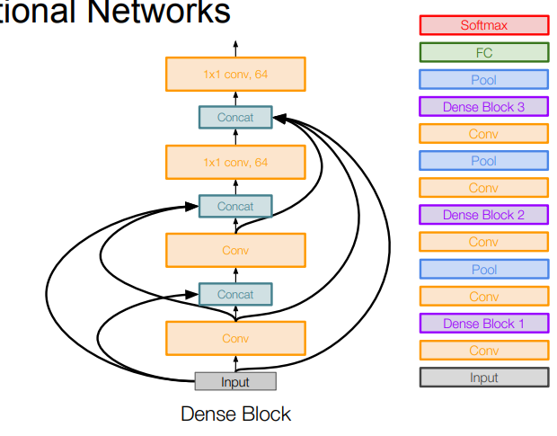
 
### 6. FractalNet (2017)
 - Residual representations are not necessary. Key is to transitioning effectively from shallow to deep, and use dropout
 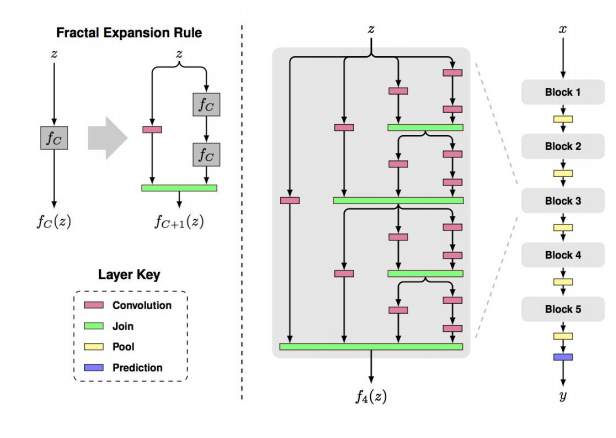
 
### 7. SqueezeNet (2017)
 - Compress network by consisting 'squeeze' layer with 1x1 filters feeding an 'expand' layer with 1x1 and 3x3
 
 
## Reference & Further readings
- Translation invariance of max pooling : https://ganghee-lee.tistory.com/43
- Usage of 1x1 conv layers : https://stats.stackexchange.com/questions/194142/what-does-1x1-convolution-mean-in-a-neural-network 
- Depthwise seperable convolutions : https://m.blog.naver.com/chacagea/221582912200
- MobileNetV2 : https://gaussian37.github.io/dl-concept-mobilenet_v2/
- EfficientNet : https://hoya012.github.io/blog/EfficientNet-review/
- NasNet : https://m.blog.naver.com/PostView.nhn?blogId=za_bc&logNo=221559482028&proxyReferer=https:%2F%2Fwww.google.com%2F
