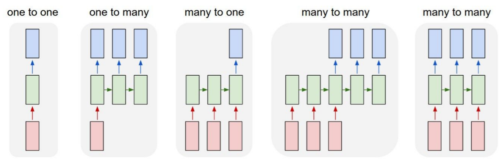
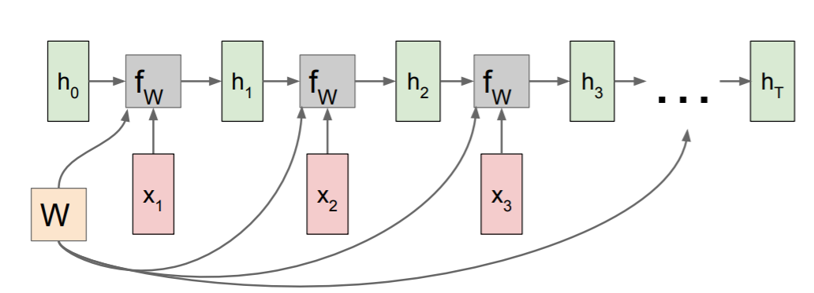
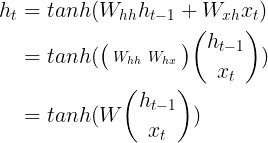
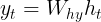
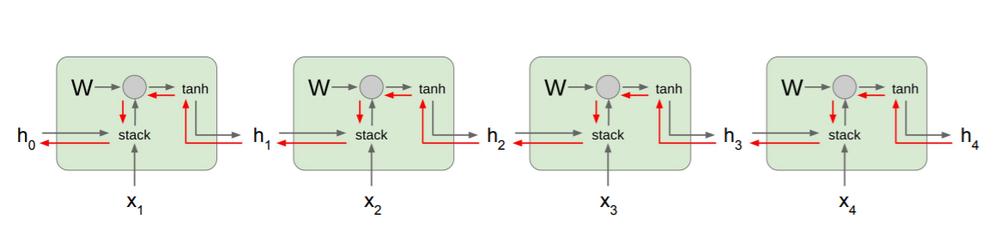
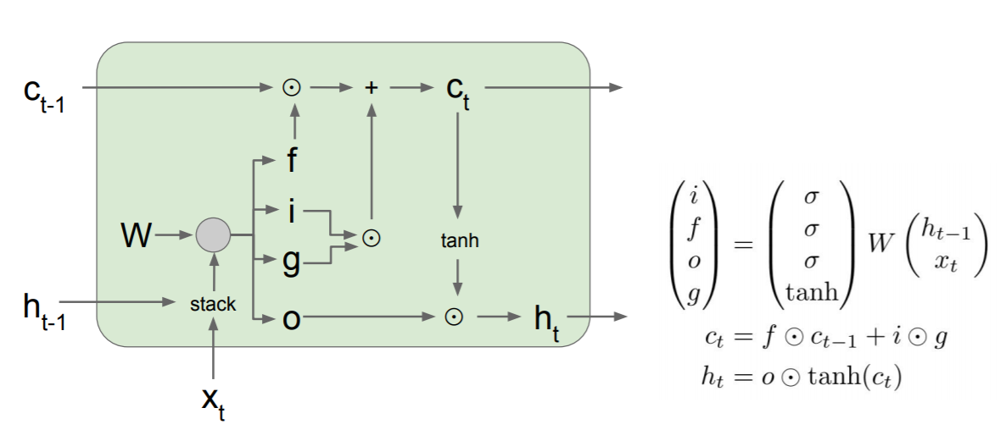
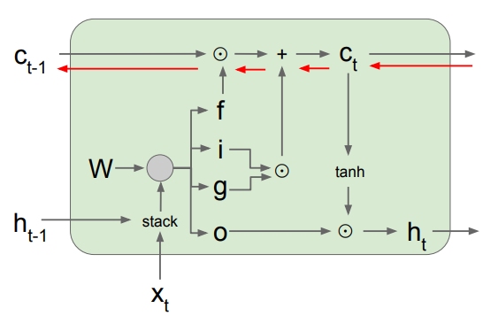
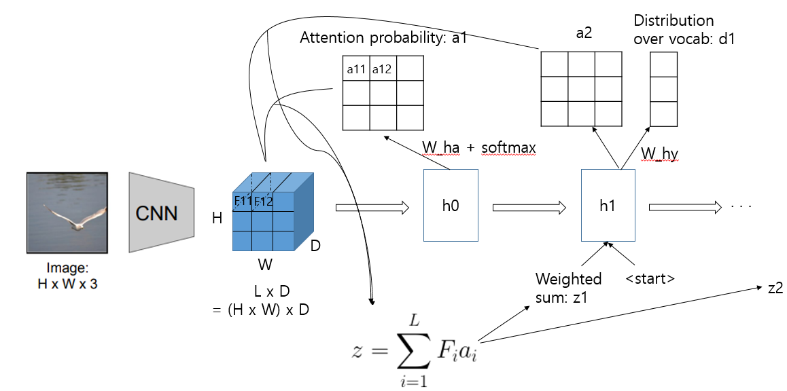

# DAVIAN Lab. Deep Learning Winter Study (2021)

- **Writer:** Jaeyoon Chun

## Information

- **Title:** (cs231n) Lecture 10: Recurrent Neural Networks
- **Link:** http://cs231n.stanford.edu/slides/2017/cs231n_2017_lecture10.pdf
- **Keywords:** RNN, LSTM, GRU, Backpropagation through time, Exploding gradients, Vanishing gradients, Attention

## Recurrent Neural Network
In a vanila feed forward neural network, we receive some input, which is a fixed size object such as image or vector, this input is fed through some set of hidden layers and produces a single output.   
On the other hand, RNN is more flexible so that it can handle different sizes of input and output data.

    

* one to many: Image captioning
* many to one: Sentiment classification
* sequence to sequence: Machine translation
* many to many: Video classification on frame level 

    

We can process a sequence of vectors x by applying a recurrence formula at every time step. Therefore, the same fucntion and the same set of parameters are **re-used** at every time step.    
The state consists of a single *hidden* vector h:    

The output of the state: 

 

### Backpropagation through time
    

The process is called backpropatation through time when we have a sequence, produce an output at every time step of the sequence and then finally compute some loss. If the sequences are very long, this will be problematic: slow, expensive computational cost.    
During the backward pass through the cell, we receive the derivative of loss w.r.t h_t and compute the derivative of loss w.r.t. h_{t-1}. In the figure 5, the gradient flows backwards through the red path. The gradient flow backwards through the tanh gate and through the matrix multiplication gate, where we end up multiplying by the transpose of the weight matrix. So the gradient of h_0 involves **many factors of W**.
* Exploding gradients: Largest singular value > 1    
To solve this problem, *gradient clipping* is used. If L2 norm of the gradient is above some heuristic threshold, we scale it so that it has the maximum threshold.
* Vanishing gradients: Largest singular valuye < 1    
We might change RNN architecture: LSTM

 

## LSTM
### Architecture

* cell state: convey information with some minor linear interactions.    

LSTM has four gates: forget, input, gate, output gate. Except for gate gate(?), a sigmoid layer is used. The sigmoid layer outputs numbers between 0~1, it decides how much of information will be let through. 
* Forget gate: Whether to rease cell
* Input gate: Whether to write to cell    
It decides which values from gate gate will be updated.
* Gate gate: How much to write to cell    
It creates a vector of new candidate values from h_{t-1} and x_{t}
* Output gate: How much to reveal cell 
### Backpropagation
    

During backpropagation from c_t to c_{t-1}, there is only elementwise multiplication by f, and no matrix multiply by W. This makes uninterrupted gradient flow.

 

## Attention
### Image captioning with attention
    

When we produce words of a image caption, we can allow the model to attend the original image. In other words, RNN focuses its attention at a different spatial location when generating each word. 
1. CNN produces some grid of vectors which give one vector for each spatial location.
2. When the model runs forward, it produces a distribution over the locations in the image where it wants to look.
3. A softmax layer outputs a probability from this distribution.
4. By element-wise product of the grid of vectors and the probability, the model outputs a single summary vector which maybe focuses the attention on one part of the image.
5. The summary vector gets fed as an additional input at the next time step of the neural network.

 

## Reference & Further readings
RNN: http://karpathy.github.io/2015/05/21/rnn-effectiveness/    
LSTM: https://colah.github.io/posts/2015-08-Understanding-LSTMs/    
GRU: https://arxiv.org/abs/1406.1078

