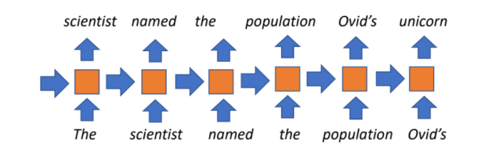
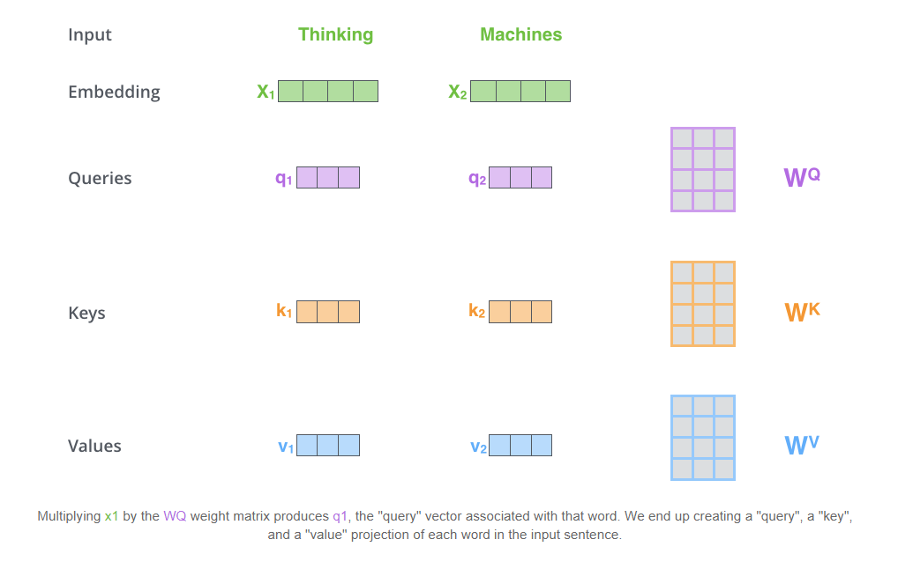
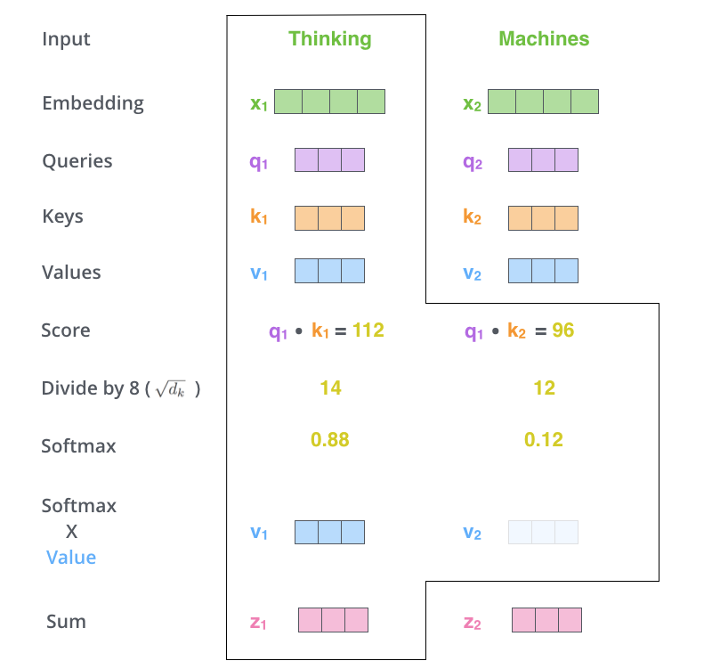
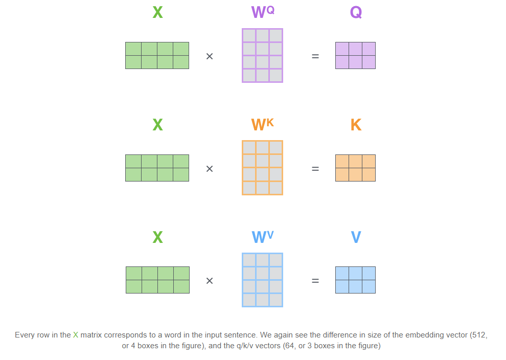
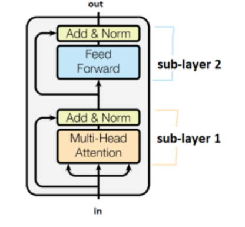
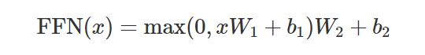

# DAVIAN Lab. Deep Learning Winter Study (2021)

- **Writer:** Dongyoon Hwang

## Information

- **Title:** (lecun) Week 12 : Deep Learning for NLP & Trans
- **Link:** https://www.youtube.com/watch?v=6D4EWKJgNn0&feature=youtu.be
- **Keywords:**  NLP, Language models, CNN Language models, RNN Language models, Transformer, self-attention

## What is NLP
### - Natural Language Processing(NLP)'s goal

 - We want AIs to have human intelligence 
 - Since the source of human intelligence is human knowledge, AIs should be able to comprehend human knowledge
 - Most human knowledge is recorded in the form of human language
 - Therefore, it is primary to make AIs that understand human language for them to be super-human intelligent
 - NLP is all about being able to make computers understand human's tool of communication

## Neural Language Models

### - What are Language model's

* For a specific sequence of words, language models evaluates the probability of the sequence occurring .

* Factorizes the probability of a text using chain rule:
*  

* Able to interpret each term as a classification problem

### - Recurrent Language Models

 * Models that are made up of RNN layers

   

 * Pros: 
   	* There is no explicit limit to the size of sequential input
 * Cons:
   	* Since context vectors have a fixed-size, there will be a limit to the amount of information the context can contain
      	* Gradients tend to vanish with long contexts
      	* Due to sequential structure, impossible to parallelize over time-steps
      	* Slow training

### - Convolutional Language Models

 * Language models that are made up of CNN layers

 * 

 * Pros:

   	* Parallelizable since there is no sequential structure within the Language model

 * Cons:

    * Only able to condition on bounded context since CNN filters have fixed receptive fields.

      * Stacking more layers on top of each other to enlargen the model's receptive field is not promising since this will make the model's complexity higher and unstable gradient flow.

    * Unnatural structure since this is not how humans interpret language

      

## Transformer Language Models

### 1. Core idea

* 
* Core idea behind the Transformer model is *self-attention*—the ability to attend to different positions of the input sequence to compute a representation of that sequence
* Overall architecture of Transformer model uses stacked self-attention and point-wise, fully connected layers for both the encoder and decoder, shown in the left and right halves of Figure 1.
* Handles variable-sized input using stacks of self-attention layers instead of RNNs or CNNs, beginning a whole new paradigm in the domain of Deep Learning

### 2. Self-attention layer

Will see in detail how self-attention is calculated in the Transformer model.

 * Step 1) Convert each input word embeddings into Query(Q), Key(K), and Value(V) embeddings
   	* For the Transformer model, the new vectors(Q, K, V) will have dimension smaller than the original embedding vector ==> Not a prerequisite, but an efficient choice

 * Step 2) Calculate the score of each input's attention vector by multiplying its corresponding query vector with every input's key vectors

    * The input's query vector will also compute a score against its own corresponding key vector

      

 * Step 3)  Normalize the scores by the square root of the dimension of the key vectors.

   	* This is just an architectural choice made in the Transformer model. This step is not part of the self-attention method. 

 * Step 4) Apply softmax

    * You'll now obtain the attention vector for current input word

   

* Step 5) Multiply each value vector by the softmax score(=attention score) and sum them up

  * Will keep intact with the values of the words we want to focus on

  * Will drown-out irrelevant words by multiplying such words with a very small softmax score

  * v1 is the value vector of the first input. v2 is the value vector of the second input

  * z1 will be the newly obtained embedding vector of the first input(Thinking)

  * z1 = 0.88 * v1 + 0.12 * v2

    

### 3.  Matrix calculation of Self-attention

### 4. Pros and Cons of Self-attention

 * Pros:
   	* All inputs(words) are directly connected, mitigating the vanishing gradient problem.
      	* All time-step computations are parallelizable, making it possible to train the model efficiently.
 * Cons:
    * Since all time-steps can attend to all others, self attention itself is quadratic, limiting the max sequence length.
      	* However, this explicit limit of max sequence length is not very problematic since real-world sequences don't have infinite lenght.
    * No explicit information about order of the sequence.
      	* Adds positional embeddings to work out this problem.
      	* 

### 5. Language Models use "Masked" Self-attention

* Apply masking while doing self-attention for Language Models.
* This is to prevent the model from getting the correct prediction trivially by just cheating the future word explicitly shown in the input sequence
* Mask out future time-steps by converting their scores to -infinity before applying softmax.

### 6. The Transformer Block in detail

* The Transformer Block is composed of a 2 sub-layers
* First sub-layer is made up of one self attention layer, a layer norm, and a residual connection
  * NLP uses layer normalization for several reasons
    * Empirically better
    * Impossible to use batch normalization in NLP setting due to large dimension of input sequences
  * Use residual connection for stable gradient flow
* Second sub-layer is made up of one feed forward network, a layer norm, and a residual connection
  * The feed forward network is applied to each position separately and identically. It consists of two linear transformations with a ReLU activation in between
  * 

## Reference & Further readings

- The Illustrated Transformer : http://jalammar.github.io/illustrated-transformer/
- Attention is all you need : https://arxiv.org/pdf/1706.03762v5.pdf
- The Annotated Transformer : http://nlp.seas.harvard.edu/2018/04/03/attention.html
- TF2 Transformer tutorial : https://www.tensorflow.org/tutorials/text/transformer
- Attention? Attention! : https://lilianweng.github.io/lil-log/2018/06/24/attention-attention.html
