# DAVIAN Lab. Deep Learning Winter Study (2021)

---

- Writer: Jaeun Jeong (VAE), Haneol Lee(Pixel CNN, Pixel RNN, GANs)

## Information

---

- **Title:** (cs231n) Lecture 13 : Visualizing and Understanding

- **Link:** http://cs231n.stanford.edu/slides/2017/cs231n_2017_lecture13.pdf

- **Keywords:** VAE, Explicit density model, PixelRNN, PixelCNN, Generative adversarial networks, KL-divergence, GANs problems, mode collapse

---

## Introduction

- Supervised Learning
  - Data: (x, y), x is data, y is label
  - Goal: Learn a function to map x -> y
  - Examples: Classification, regression, object detection, semantic segmentation, image captioning, etc.

- Unsupervised Learning
  - Data: x, x is data
  - Goal: Learn some underlying hidden structure of the data
  - Examples: Clustering, dimensionality reduction, feature learning, density estimation, etc

- Generative Models

  - Given training data, generate new samples from same distribution
  - Want to learn $p_{model}(x)$ similar to $p_{data}(x)$

  - **Taxonomy of Generative models:**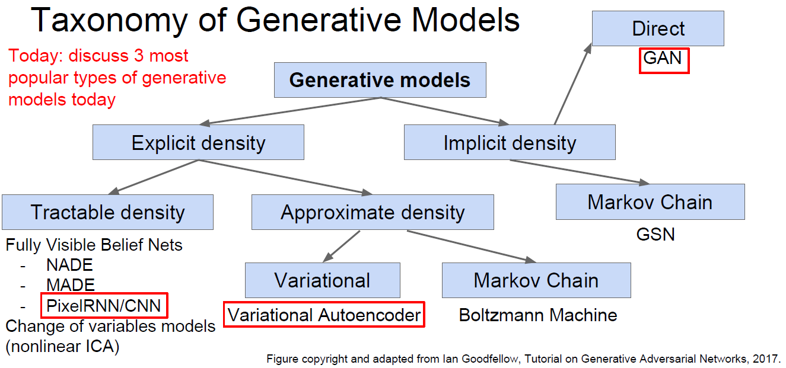image reference: [[1](http://cs231n.stanford.edu/slides/2017/cs231n_2017_lecture13.pdf)]

## PixelRNN and PixelCNN

### Explicit density model

Explicit density model, optimizes exact likelihood, good samples. But inefficient sequential generation.

- Use chain rule to decompose likelihood of an image x into product of 1-d distributions:

  $p_{\theta}(x)=\prod_{i=1}^{n} p_{\theta}(x_i|x_1, ..., x_{i-1})$

  $p_{\theta}(x)$ : Likelihood of image X

  $\prod_{i=1}^{n} p_{\theta}(x_i|x_1, ..., x_{i-1})$ : Probability of i'th pixel value given all previous pixels

- Then maximize likelihood of training data.

- Complex distribution over pixel values (So express using a neural network)

- Need to define ordering of **previous pixels**

### PixelRNN

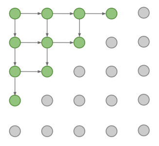 

Figure 1: Visualization example of previous pixels: [[1](http://cs231n.stanford.edu/slides/2017/cs231n_2017_lecture13.pdf)]

- Generate image pixels starting from corner.
- Dependency on previous pixels now modeled using an RNN (LSTM).
  - In this example, the pixels to the left and top of the current pixel are defined as the previous pixels.
  - If no previous pixel, use  padding.
- Drawback: 
  - Sequential generation is slow.

### PixelCNN

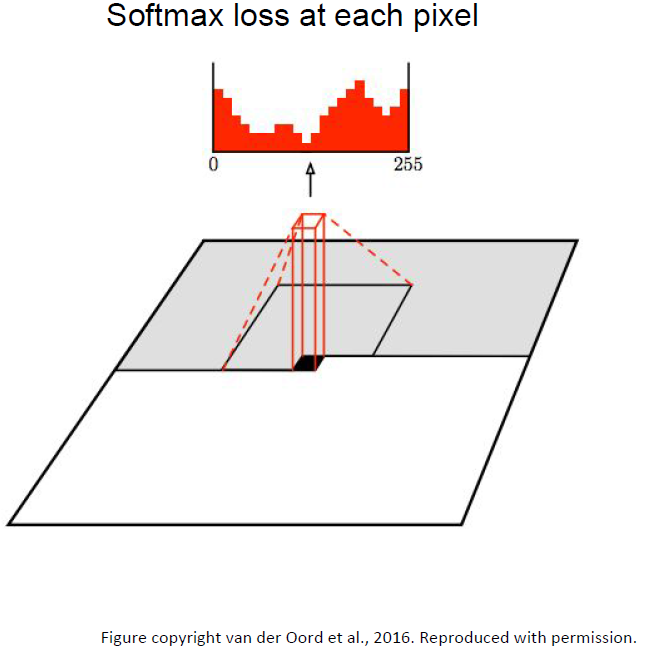 

Figure 2: A visualization of the PixelCNN that maps a neighborhood of pixels to prediction for
the next pixel. To generate pixel $x_i$ the model can only condition on the previously generated pixels
$x_1$, . . . $x_{i−1}$. [4]

- Generate image pixels starting from corner

- Dependency on previous pixels now modeled using a CNN over context region

- Training: maximize likelihood of training images

  $p_{\theta}(x)=\prod_{i=1}^{n} p_{\theta}(x_i|x_1, ..., x_{i-1})$

- Drawback: 

  - The generation process is still slow. (Because generation must still proceed sequentially)
  - The major drawback of Pixel CNN is that it’s performance is worse than Pixel RNN.
  - Another drawback is the presence of a Blind Spot in the receptive field. (Masking $x_i$ and all pixels next to $x_i$ pixel (e.g. $x_{i+1}$, $x_{i+2}$, ...) in the receptive field at training step.
  
- **Pros**: 

  - Can explicitly compute likelihood $p(x)$ 
  - Explicit likelihood of training data gives good evaluation metric
  - Good samples

- **Con**:

  - Slow because of sequential generation

- Improving PixelCNN performance

  - Gated convolutional layers
  - Short_cut connections
  - Discretized logistic loss
  - Multi-scale
  - Training tricks

  

---

## Variational Autoencoders (VAE)

### Bayesian Framework

The main difference between bayesians and frequentists is that the first considers the parameter we'd like to estimate as a **random variable**, whereas the second thinks it as a fixed constant.

For example, let's say we have data of heights. Probably we'd like to know the mean of the data which can be written as $\mu$. Frequentists assume that it is a fixed constant and estimate it by ML method. Bayesians, on the other hand, define prior distribution of $\mu$ and get additional information from the data we've got.

The key idea of bayesians: **combine data with prior belief** or **derive posterior distribution from prior distribution and data**

$p(\theta\vert X) = \frac{\prod_{i=1}^{n}{p(x_{i}\vert\theta)p(\theta)}}{\int {\prod_{i=1}^{n}{p(x_{i}\vert\theta)p(\theta)d\theta}}} \text{ where } x_{i}'s \text{ are i.i.d samples}$

$x$: features, $y$: class label/latent vector, $\theta$: parameter of interest.

We'd like to know the joint distribution of $y, \theta$ given $x$.

- $p(y, \theta \vert x) = p(y \vert \theta, x)p(\theta) \text{ } \because x \perp\theta$ 
- $p(\theta \vert X, Y) = \frac{p(Y \vert X, \theta)p(\theta)}{\int p(Y \vert X, \theta)p(\theta)}\text{ where X, Y denote whole training set}$
- test: $p(y \vert x, X, Y) = \int{ p(y \vert x, \theta)p(\theta \vert X, Y)d\theta}$

**Problem**: Unless
$p(y \vert x, \theta)$ and $p(\theta)$ are conjugate, it's intractible mainly due to integral.

(**[conjugate prior](https://en.wikipedia.org/wiki/Conjugate_prior))**

#### cf. Poor Bayes

- $\theta_{MP} = argmax_{\theta}p(\theta \vert X, Y) = argmax_{\theta}P(Y \vert X, \theta)p(\theta)$
- $p(y \vert x, X, Y) \approx p(y \vert x, \theta_{MP})$

### Variational Inference

#### Main Goal: to estimate $p(\theta \vert x)$

No conjugacy => impossible to solve analytically.

1. **variational inference**: $q(\theta) \approx p(\theta \vert x)$
2. **sampling based method**: sample from $p(x \vert \theta)p(\theta)$, time consuming.

We want to know the first method(variational inference) - assume approximate posterior and estimate it to be close to true posterior. To estimate the distance btw distributions, we use KL-divergence.

$\hat{q}(\theta) = argmin_{q}D_{KL}(q(\theta) \vert\vert p(\theta \vert x)) = argmin_{q} \int q(\theta)log\frac{q(\theta)}{p(\theta \vert x)}d\theta$

- Prob1: We don't know $p(\theta \vert x)$
- Prob2: How can we optimize with respect to probability distribution?

**Sol)**

$logp(x) = E_{q(\theta)}[logp(x)] = \int q(\theta)logp(x)d\theta = \int q(\theta)log\frac{p(x, \theta)}{p(\theta \vert x)}d\theta= \int q(\theta)log\frac{p(x, \theta)}{p(\theta \vert x)}\frac{q(\theta)}{q(\theta)}d\theta$

 $= \int q(\theta) log\frac{p(x, \theta)}{q(\theta)}d\theta + \int q(\theta) log\frac{q(\theta)}{p(\theta \vert x)}d\theta = \mathcal{L}(q(\theta)) + D_{KL}(q(\theta) \vert\vert p(\theta \vert x))$

 Hence, it is equal to minimize $D_{KL}(q(\theta) \vert\vert p(\theta \vert x))$ and maximize $\mathcal{L}(q(\theta))$.

 $\mathcal{L}(q(\theta)) = \int q(\theta) log\frac{p(x, \theta)}{q(\theta)}d\theta = \int q(\theta) log\frac{p(x \vert \theta)p(\theta)}{q(\theta)}d\theta$

 <b>$= E_{q(\theta)}[logp(x \vert \theta)] - D_{KL}(q(\theta) \vert\vert p(\theta)) = \text{data likelihood + KL-regularizer term}$</b>

 Then how can we optimize $q(\theta)$?

1. **[mean field approximation](https://en.wikipedia.org/wiki/Variational_Bayesian_methods)**: can be used when $\theta$s are ind.
2. **parametric approximation**: the most popular method in deep learning. Define $q(\theta)=q(\theta \vert \lambda)$ and optimize with respect to $\lambda$.

### Stochastic Variational Inference and VAE

#### Main goals of VAE

1. Quality generation => maximize $logP(X)$
2. Learn distribution of latent variable Z => $q(Z \vert X) \approx p(Z \vert X)$

To achieve the first goal,  ([img source](http://cs231n.stanford.edu/slides/2017/cs231n_2017_lecture13.pdf))

The rest except the final KL-term is now lower bound. **Therefore, maximizing $logP(X)$ also enables us to maximize the lower bound, resulting the fulfillment of the second goal!** Lower bound is as follows:

**$\mathcal{L}(\theta, \phi; x^{(i)}) = D_{KL}(q(z \vert x^{(i)}) \vert\vert p(z))+\mathbb{E_{q(z \vert x^{(i)})}}[logp(x^{(i)} \vert z)]$**

**The formal one is KL term btw prior and approximate posterior and the latter equals to decoder probability.** In original VAE paper, $q(z \vert x)$ is defined as follows:

$q(z_{i} \vert x_{i}, \phi) = \prod_{j=1}^{d}\mathcal{N}[\mu_{j}(x_{i}), \sigma_{j}^{2}(x_{i})]$

$\mu_{j}(x_{i}), \sigma_{j}^{2}(x_{i})$ are the outputs of $DNN(x_{i})$. Encoder of VAE gets $\mu_{j}(x_{i}), \sigma_{j}^{2}(x_{i})$. Then we can get KL-divergence of $p(z), q(z \vert x)$. (Both are normal dists.) **This term acts as a regularizer: approximate posterior should be similar to prior distribution.**

If we look decoder probability, we have to get the mean of $\log(x \vert z)$ based on $q(z \vert x)$ and we now face intractibility. Besides, sampling is not diffrentiable operations so backpropagation can't be used.

To handle these problems, we use **reparameterization trick**!

$q_{\phi}(z \vert x) \rightarrow g(\epsilon, x)$

This is all about linear regression!

Linear regression assumes that $y$ and $x$ are in linear relationship and solves $a, b$ from $y = ax+b+\epsilon$. Then it is equivalent to get $p(y \vert x)$. Since $x$ is given, $a, b$ are constants the one and only random factor is $\epsilon$ ~ $N(0, 1)$. Therefore, $p(y \vert x)$is the normal distribution which has $ax+b$ as $\mu$ and variance 1. $a, b$ can be solved by MLE method and they are closed-from solutions. This is very similar to VAE.

$g(\epsilon, x)$ thinks itself as a deterministic function but $\epsilon$ has come from outside. **Now it is differentiable, and end-to-end learning is possible!**

However, VAE suffers from blurry generation. Since approximate posterior acts as a regularizer and reconstrucion loss is the actual loss, VAE is learned to maximize $\log(x \vert z)$. It is a kind of linear regression and outputs tend to be close to $\mathbf{E}(x)$.

---

## Generative Adversarial Networks  (GANs)

- The ultimate goal of GANs is generating data approximating real data distribution.

- Take game-theoretic approach, learn to generate from training distribution through 2-player game.  But can be tricky and unstable to train, no inference queries such as $p(x)$, $p(z|x)$.

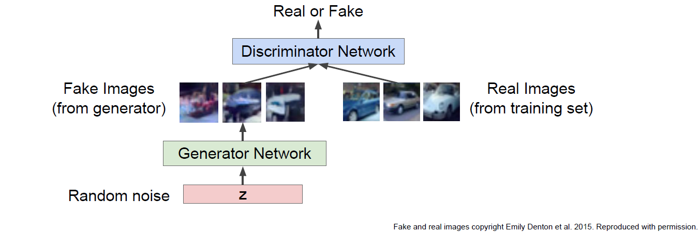 Fake and real images [[1](http://cs231n.stanford.edu/slides/2017/cs231n_2017_lecture13.pdf)]

- Problem: Want to sample from complex, high-dimensional training distribution. No way to do this.
- Solution: Sample from a simple distribution, e.g. random noise. Learn transformation to training distribution.

### Training GANs: Two-player game

- Minmax objective function:

 Minmax objective loss function [[1](http://cs231n.stanford.edu/slides/2017/cs231n_2017_lecture13.pdf)]

- Generator($\theta_g$) network: try to fool the discriminator by generating real-looking images
  
  - Generator($\theta_g$) wants to minimize objective such that D(G(z)) is close to 1 (discriminator is fooled into thinking generated G(z) is real).
- Discriminator($\theta_d$) network: try to  distinguish between real and fake images
  - Discriminator($\theta_d$) wants to maximize objective such that D(x) is close to 1 (real) and D(G(Z)) is close to 0 (fake).
  - Discriminator outputs likelihood in (0,1) of real image

- Gradient ascent and descent of GANs in practice

  1. **Gradient ascent** on discriminator:

     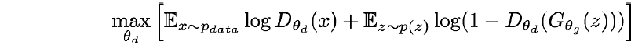 

  2. **Gradient descent** on generator in origin:

     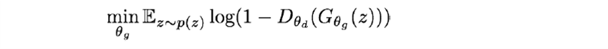

     - In practice, optimizing the generator objective function does not work well.

     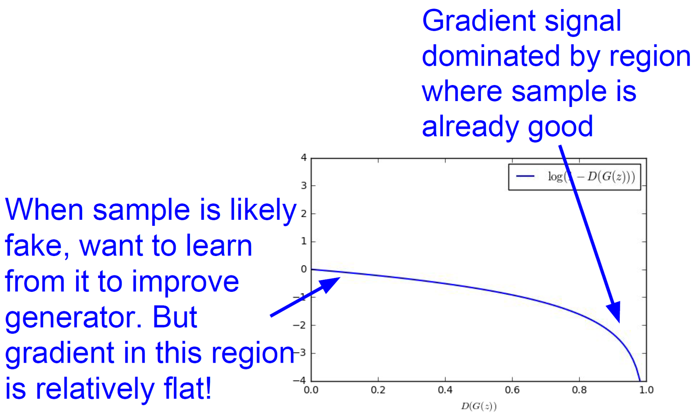 Figure 3: [[1](http://cs231n.stanford.edu/slides/2017/cs231n_2017_lecture13.pdf)]

     - When sample is likely fake, want to learn from it to improve generator. But gradient in this region is relatively flat.

     - Gradient signal dominated by region where sample is already good.

  3. **Gradient ascent** on generator **in standard practice (Instead of the "2. Gradient descent on generator in origin"):**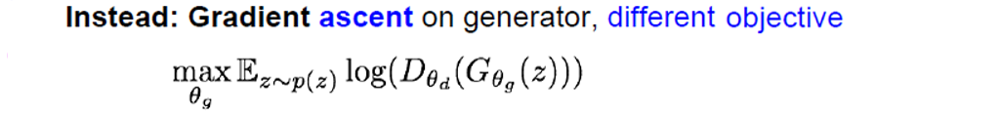 

     - Instead of minimizing likelihood of discriminator being correct, now maximize likelihood of discriminator being wrong.

     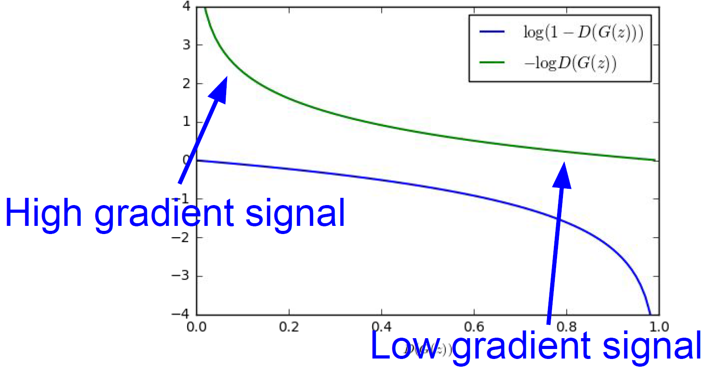 Figure 4: [[1](http://cs231n.stanford.edu/slides/2017/cs231n_2017_lecture13.pdf)]  

     - Same objective of fooling discriminator, but now higher gradient signal for bad samples. So it works better.

     - Jointly training two networks is challenging, can be unstable.
       - Choosing objectives with better loss landscapes helps training.

### Generative model with KL-divergence [9]

Generative models create a model $\theta$ that maximizes the maximum likelihood estimation (MLE). to find the best model parameters that fit the training data the most.

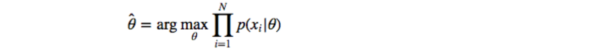

- This is the same as minimizing the KL-divergence $KL(p,q)$ which measures how the estimated probability distribution $q$ diverges from the real world expected distribution p. ([proof in detail](https://jhui.github.io/2017/01/05/Deep-learning-Information-theory/))

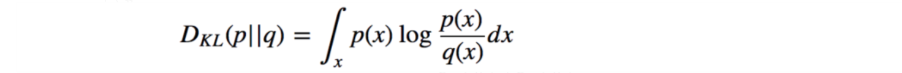

- KL-divergence is not symmetrical.

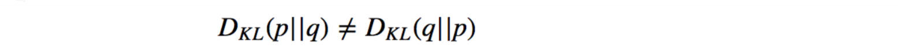

- As you see in figure 5, the KL-divergence $D_{KL}(p||q)$ penalizes the generator if it misses some modes of images: the penalty is high where $p(x) > 0$ but $q(x) → 0$. Nevertheless, it is acceptable that some images do not look real. The penalty is low when $p(x) → 0$ but $q(x) > 0$. **(Poorer quality but more diverse samples)**

- On the other hand, the reverse KL-divergence $D_{KL}(q||p)$ penalizes the generator if the images do not look real: high penalty if *p(x) → 0* but *q(x) > 0*. But it explores less variety: low penalty if *q(x) → 0* but *p(x) > 0*. **(Better quality but less diverse samples)**

  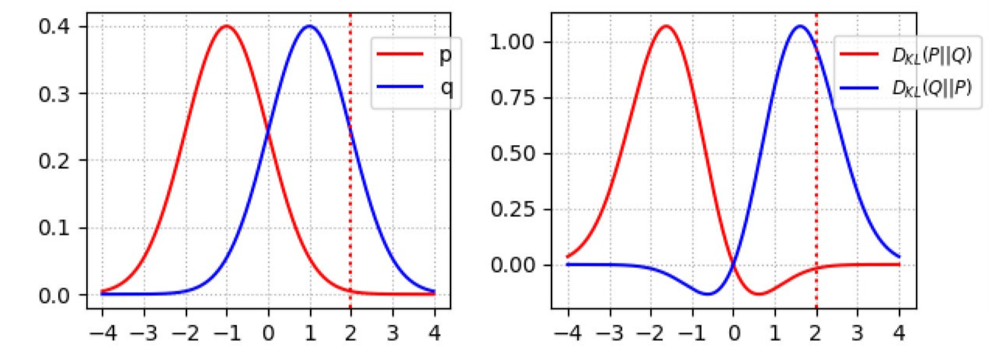 Figure 5: probability density function of p and q (left), KL-divergence of $p$ and $q$ (right) [9]

### GANs problems

- **Non-convergence**: the model parameters oscillate, destabilize and never converge.
- **Mode collapse**: the generator collapses which produces limited varieties of samples.
- **Diminished gradient**: the discriminator gets too successful that the generator gradient vanishes and learns nothing.
- Unbalance between the generator and discriminator causing overfitting.
- Highly sensitive to the hyper parameter selections.

### Mode collapse

**Mode collapse** refers to the phenomenon that the model we are trying to train does not cover all the distribution of the actual data and loses diversity. This is a case where *G* cannot find the entire data distribution because it is only learning to reduce the loss, and it is strongly concentrated in only one *mode* at a time as shown in the figure below. For example, this is the case where *G* trained on MNIST generates only certain numbers. [7]

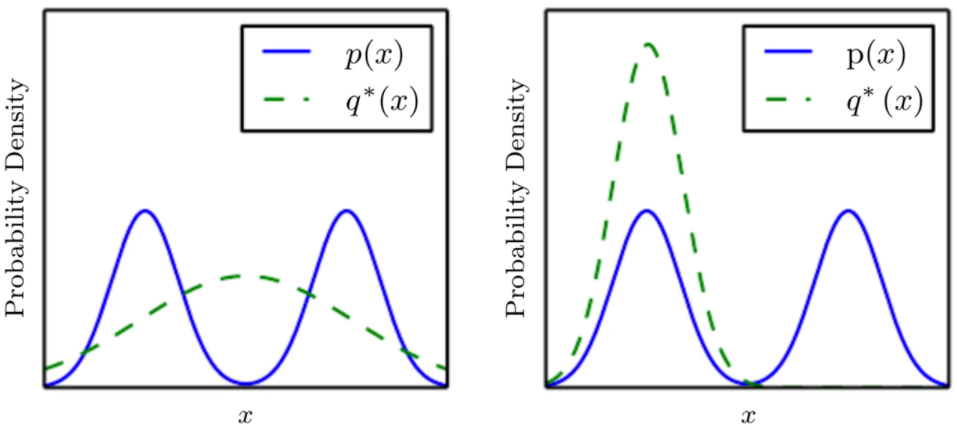The problem that the probability density functions of generator and discriminator are alternatively vibrating without converging is related to mode collapse [7]

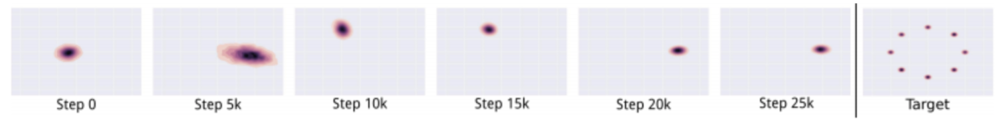 mode collapse example [7], [9]

### Solutions of mode collapse problem

The key to solve the model collapse is to train the model to learn the boundaries of the entire data distribution evenly and keep it remembered.

- **feature matching** : Add **least square error** between fake data and real data to the objective function 
- **mini-batch discrimination** : Add the sum of distance difference between fake data and real data for each *mini-batch* to the objective function.

- **historical averaging** : Update the loss function to incorporate history.

## Conclusion

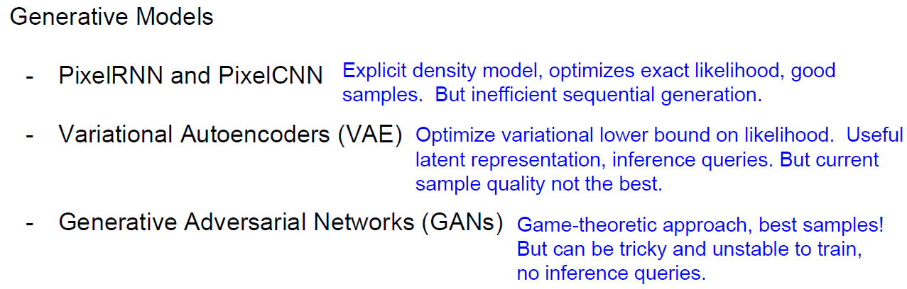

## References

- [1] [cs231n 2017 lecture13](http://cs231n.stanford.edu/slides/2017/cs231n_2017_lecture13.pdf)
- [2] [Generative Adversarial Networks](https://arxiv.org/abs/1406.2661)
- [3] [Pixel RNN](https://arxiv.org/pdf/1601.06759.pdf)
- [4] [Pixel CNN](https://arxiv.org/abs/1606.05328v2), [Pixel CNN v2](https://arxiv.org/abs/1606.05328)
- [5] https://towardsdatascience.com/auto-regressive-generative-models-pixelrnn-pixelcnn-32d192911173
- [6] [cs231n 2020 lecture11](http://cs231n.stanford.edu/slides/2020/lecture_11.pdf)
- [7] [mode collapse in GANs](https://ratsgo.github.io/generative%20model/2017/12/20/gan/)
- [8] [developers.google.com: mode collapse](https://developers.google.com/machine-learning/gan/problems)
- [9] [solutions of mode collapse](https://jonathan-hui.medium.com/gan-why-it-is-so-hard-to-train-generative-advisory-networks-819a86b3750b#4987)